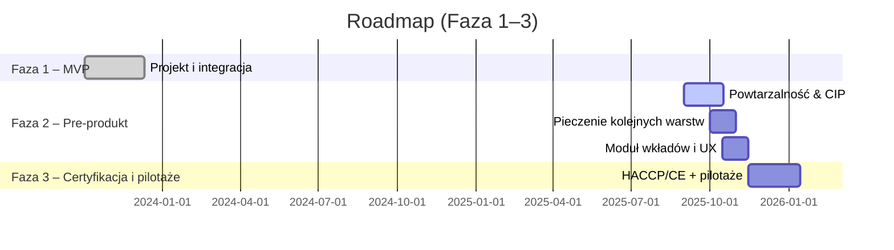
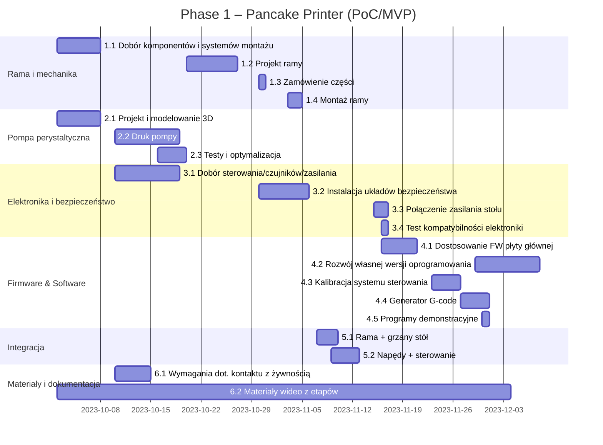
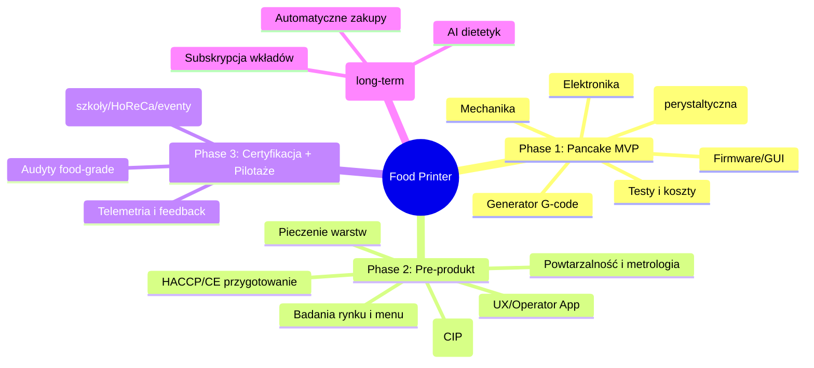

# Food Printer — od MVP do platformy „FoodOS”

## 1. Cel projektu i kontekst
Celem projektu jest opracowanie domowego systemu druku żywności, łączącego automatyzację przygotowania posiłków z personalizacją żywieniową. Projekt adresuje podstawowe potrzeby żywieniowe (piramida Maslowa) oraz problemy rynku żywności: wysoki poziom przetworzenia, marnotrawstwo składników, nieprzejrzyste łańcuchy dostaw i wzrost chorób dietozależnych. Zakładany wpływ społeczny obejmuje łatwiejszy dostęp do zdrowych, spersonalizowanych i powtarzalnych posiłków oraz redukcję odpadów.

## 2. Fazy i status
- **Faza 1 – Pancake Printer (PoC/MVP)** — zakończona. Potwierdzono wykonalność techniczną i sens ekonomiczny druku naleśników w wielu kolorach i kształtach.
- **Faza 2 – Pre-produkt** — w toku. Cel: zwiększenie powtarzalności, pieczenie kolejnych warstw, modernizacja wkładów i dozowania (CIP), konsultacje z użytkownikami i dobór menu startowego.
- **Faza 3 – Certyfikacja i pilotaże** — planowana. Pakiet HACCP/CE oraz pilotaże w wybranych lokalizacjach.
- **Wizja długoterminowa – „FoodOS”** — platforma do wielu potraw, subskrypcyjny model wkładów oraz komponenty AI wspierające dobór diety, harmonogram i zakupy.

## 3. Zakres rzeczowy (skrót)
**W zakresie:** mechanika (CoreXY), dozowanie (pompa perystaltyczna z kompensacją), sterowanie/GUI, generator ścieżek (PNG/SVG → G-code), proces termiczny, higiena/CIP, przygotowanie zgodności (HACCP/CE), badania użytkowników i pilotaże.  
**Poza zakresem obecnych faz:** zaawansowana diagnostyka medyczna i pełna industrializacja produkcji wkładów.

## 4. Rezultaty Fazy 1 (MVP)
- **Mechanika:** rama z profili aluminiowych 30×30; kinematyka **CoreXY** (paski **GT2**); oś Z: **NEMA17 + śruba T8** (nakrętka kompensująca luz).
- **Napędy/sterowanie:** silniki **NEMA17** ze sterownikami **TMC2209** (feedback ze sterowników – podejście hybrydowe), płyta **BTT Octopus**, autorski firmware i **GUI** dotykowe.
- **Proces termiczny:** elektryczny grill z kontrolą temperatury.
- **Dozowanie:** własny projekt **pompy perystaltycznej** z kompensacją pulsacji (A) oraz wariant B (bez kompensacji). W macierzy decyzji (Pugh) rozwiązanie A uzyskało najlepszy wynik dla kryteriów: koszt, zgodność „food-grade”, kompatybilność z systemem, precyzja dozowania, czyszczenie oraz czas developmentu.
- **Pipeline:** grafika (PNG/SVG) → separacja kolorów → mapowanie na kanały → **G-code** → druk.
- **Ekonomia jednostkowa (z prób):** składniki ok. **7,20 zł / 1,5 kg** ciasta; energia ok. **0,09 zł** na wydruk; koszt jednostkowy ok. **0,34 zł / naleśnik** (założenia w arkuszu kosztów).
- **Artefakty:** demo wideo (MVP), rendery, zdjęcia próbek, porównanie pulsacji (A vs B), macierz Pugh.

## 5. Architektura techniczna (skrót)
- **Mechanika:** CoreXY/GT2, prowadnice liniowe, separacja stref napędowej i „czystej”.
- **Elektronika:** BTT Octopus, TMC2209, czujniki (temperatura/pozycja), zasilanie i zabezpieczenia (E-stop, bezpieczniki).
- **Dozowanie i kanały:** pompa perystaltyczna NEMA17 z kompensacją; obecnie moduł przekaźnikowy 4–8 kanałów (docelowo PCB z tranzystorami).
- **Oprogramowanie:** firmware, GUI operatora, generator ścieżek; profile pieczenia i kalibracje.
- **Higiena/CIP:** konstrukcja DfC (design-for-cleaning), szybki demontaż, materiały dopuszczone do kontaktu z żywnością.

## 6. Plan prac i zarządzanie
**Work Packages:** WP1 Zarządzanie; WP2 Mechanika; WP3 Dozowanie; WP4 Elektronika/bezpieczeństwo; WP5 Firmware/Software; WP6 Testy i walidacja; WP7 Zgodność i certyfikacja; WP8 Pilotaże i wejście na rynek.

**Harmonogram (skrót):**

```WBS (orientacyjnie):
mindmap
  root((Food Printer))
    WP1 Zarządzanie
    WP2 Mechanika
    WP3 Dozowanie
    WP4 Elektronika
    WP5 FW/SW
    WP6 Testy
    WP7 Zgodność
    WP8 Pilotaże
```
Proces i jakość: repozytorium Git z szablonami Issue/PR, tablicą Kanban, przeglądami tygodniowymi, checklistami jakości i wersjonowaniem artefaktów.
. KPI i kryteria sukcesu

Techniczne: odchyłka dozowania ≤ 5%; CIP ≤ 10 min; awaryjność < 2% / 100 h; energia ≤ 0,1 kWh / porcję.
Użytkowe: NPS ≥ 40; czas przygotowania porcji ≤ 3 min; satysfakcja smaku ≥ 4/5.
Środowiskowe: odpad ≤ 5 g / porcję.
Biznesowe: koszt porcji konkurencyjny wobec alternatyw; co najmniej 2–3 listy intencyjne na pilotaże.

8. Ryzyka i działania ograniczające

Higiena/CIP — ryzyko niewystarczającej czystości; działanie: projekt „design-for-cleaning”, testy ATP, materiały food-grade.

Pulsacja przy gęstych pastach — ryzyko jakości wzoru; działanie: kompensacja pulsacji, profil prędkości, opcjonalne podgrzewanie przewodów.

Zgodność (HACCP/CE) — ryzyko wydłużenia; działanie: równoległy pre-audyt i przygotowanie dokumentacji.

Akceptacja rynku — ryzyko niskiego NPS; działanie: iteracje menu, badania UX, materiały instruktażowe.

9. Struktura repozytorium (skrót)

hardware/ — CAD (STEP/STL), rysunki 2D, BOM, pompa perystaltyczna (A/B), rendery i zdjęcia.

electronics/ — KiCad (schemat/PCB/Gerbery), pinout, wiązki, zabezpieczenia.

firmware/, software/ — konfiguracja BTT Octopus/TMC2209, GUI, generator G-code (PNG/SVG → G-code).

tests/ — powtarzalność, energia, protokoły.

docs/ — Gantt/WBS (Mermaid), macierze decyzji, zgodność (HACCP draft, ścieżka CE, GDPR/DMP).

marketing/ — demo wideo, zdjęcia, rendery.

business/ — koszty jednostkowe, konkurencja, plan pilotaży.

grants/ — narracje, budżety, logframe, rejestr ryzyk i wskaźniki wpływu.

10. Materiały referencyjne

Macierz decyzji (Pugh) dla systemu transportu i dozowania.

Arkusz kosztów (składniki/energia) wraz z założeniami.

Nagrania demonstracyjne MVP i porównania pulsacji (A vs B).

Media – wstaw linki/obrazy po dodaniu do repo:

Demo wideo: marketing/videos/demo_phase1.mp4

Render przodu: marketing/images/front_render.png

Pugh matrix: docs/engineering/decision_matrices/pugh_dosing.png


---

## `docs/pm/gantt_phase1.md`
```markdown
# Gantt — Faza 1 (MVP)



---

## `docs/pm/wbs.md`
```markdown
# WBS — struktura prac




---

## `docs/impact/social_impact.md`
```markdown
# Wpływ społeczny (skrót)

- **Zdrowie publiczne:** spersonalizowane posiłki o znanym składzie; ograniczenie udziału produktów wysoko przetworzonych.
- **Środowisko:** precyzyjne porcjowanie i redukcja odpadów; racjonalne zużycie energii i wody (CIP).
- **Włączenie:** wsparcie osób zapracowanych, seniorów i szkół dzięki prostemu interfejsowi i automatyzacji.
- **Edukacja i kreatywność:** „programowalne jedzenie” jako narzędzie edukacyjne i eventowe.

**Mierniki (pilotaże):** NPS, odpad [g/porcję], energia [kWh/porcję], odchyłka dozowania [%], czas CIP [min], czas przygotowania [min].
```
