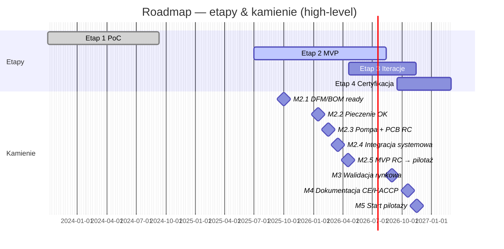
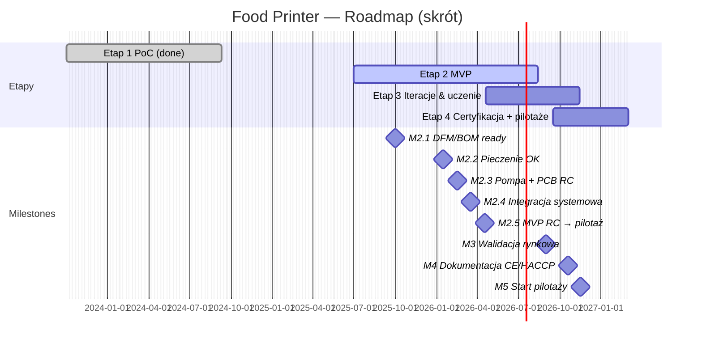

# Food Printer — od MVP do platformy „FoodOS”

---

## 1. Cel projektu i kontekst
Projekt dotyczy opracowania domowego systemu druku żywności, łączącego automatyzację przygotowania posiłków z personalizacją żywieniową. Adresuje on podstawę piramidy Maslowa (odżywianie) i bieżące problemy rynku żywności: wysoki poziom przetworzenia, marnotrawstwo, nieprzejrzyste łańcuchy dostaw oraz wzrost chorób dietozależnych. Zakładany wpływ społeczny obejmuje łatwiejszy dostęp do zdrowych, spersonalizowanych posiłków oraz redukcję odpadów i zużycia energii.

**Teza projektu:** druk żywności w warunkach domowych może być technicznie wykonalny, ekonomicznie uzasadniony i korzystny społecznie – pod warunkiem zapewnienia powtarzalności procesu, higieny (CIP) i zgodności z normami bezpieczeństwa.


## 2. Fazy i status

| Etap | Status | Ramy czasowe | Cel etapu (skrót) |
|------|--------|--------------|-------------------|
| **Etap 1 — PoC** | **zakończony** | 2023-10-02 → 2024-09-11 | dowód koncepcji druku naleśników w różnych kształtach/kolorach + wstępna walidacja ekonomiczna |
| **Etap 2 — MVP** | **w toku** | 2025-07-01 → 2026-04-18 | stabilne dozowanie, pieczenie warstwowe, komora klimatyczna, szybka wymiana wkładów, GUI + CIP |
| **Etap 3 — Iteracje rynkowe** | planowany | 2026-04-19 → 2026-09-15 | feedback z pilotaży, iteracje HW/SW, walidacja KPI (NPS, waste, repeatability) |
| **Etap 4 — Certyfikacja & pilotaże** | planowany | 2026-09-15 → 2027-01-13 | HACCP/CE, audyty, pilotaże w środowiskach docelowych (szkoły, HoReCa, eventy) |


## 3. Zakres rzeczowy (skrót)

### W zakresie realizacji (Etapy 1 → 4)

- **Mechanika** – konstrukcja modułowa z profili 30 × 30 mm, kinematyka **Core XY**, prowadnice liniowe, oś Z na T8/NEMA 17.  
- **Dozowanie** – pompa perystaltyczna z kompensacją pulsacji (A → wariant produkcyjny), wielokanałowa architektura z PCB sterującą (Etap 2).  
- **Pieczenie** – stół grzewczy (bottom-heating) + moduł górny (top-heating); profile termiczne sterowane PID; komora z kontrolą klimatu.  
- **Sterowanie** – płyta **BTT Octopus** + **TMC2209**, E-stop, bezpieczniki; pcb “pump-switch” dla kanałów dozowania.  
- **Oprogramowanie** – firmware, GUI (flow: wzór → kalibracja → druk → CIP), pipeline PNG/SVG → G-code, profile pieczenia.  
- **Procedury higieniczne** – design-for-cleaning, instrukcje CIP/SOP, pomiary ATP (Etap 2/3).  
- **Testy i walidacja** – powtarzalność (≤ 5 %), energia, sensoryka, NPS; walidacja MVP (Etap 2), iteracje rynkowe (Etap 3).  
- **Zgodność** – dokumentacja HACCP draft, ścieżka CE/LVD/EMC, pre-audyt (Etap 3) + pełne zgłoszenie (Etap 4).  
- **Komunikacja i pilotaże** – rendery, wideo, ankiety, raporty pilotażowe; pitch-deck i one-pager do grantów.  
- **Pakiet grantowy** – narracja, logframe, work-plan, budżet high-level, rejestr ryzyk.

### Poza zakresem publicznym repo (krótkoterminowo)

- Pełna, przemysłowa produkcja wkładów spożywczych (skala fabryczna).  
- Zaawansowana diagnostyka medyczna / doradztwo kliniczne.  
- Integracje z zewnętrznymi systemami e-health bez odrębnych analiz prawnych.

Zakres jest modułowy, co pozwala równolegle rozwijać mechanikę, elektronikę i software oraz przygotowywać dokumentację compliance (Etapy 3–4).

---

## 4. Rezultaty Etapu 1 (PoC)

<p align="center">
  <a href="https://www.youtube.com/watch?v=P8IgyybBxyM">
     
  </a>
</p>

- **Mechanika** – rama 30×30, **Core XY/GT2**, oś Z: NEMA 17 + śruba T8 z nakrętką kompensującą luz.  
- **Sterowanie** – BTT Octopus + TMC2209 (hybrydowe sprzężenie), autorskie GUI dotykowe.  
- **Pieczenie** – elektryczny grill z kontrolą temperatury.  
- **Dozowanie** – pompa perystaltyczna wariant A (konpat. pulsacji) vs B; wybrano **A** na podstawie macierzy Pugh.  
- **Pipeline** – PNG/SVG → separacja kolorów → G-code → druk.  
- **Ekonomia** – ~0,42 zł / naleśnik (70 g) przy koszcie energii ~0,09 zł i składnikach ~0,34 zł.  
- **Artefakty** – demo wideo, rendery, zdjęcia próbek, porównanie pulsacji (A vs B).

<p align="center">
  
</p>

*[Szczegóły etapu 1](phases/Phase_1.md)*

phases/Phase_1.md

---

## 5. Architektura techniczna (skrót)

- **Mechanika** – Core XY + GT2, prowadnice liniowe, separacja stref „napęd” / „czysta”.  
- **Elektronika** – Octopus, TMC2209, czujniki T°, E-stop, bezpieczniki.  
- **Dozowanie** – pompa perystaltyczna A, 8-kanałowe PCB (Etap 2) zamiast przekaźników.  
- **Software** – firmware + GUI, generator G-code, profile termiczne.  
- **Higiena** – szybki demontaż, materiały food-grade, CIP ≤ 10 min (target).  


---

## 6. Plan prac i zarządzanie

### 6.1 Work Packages

WP1 PM;&nbsp;WP2 Mechanika;&nbsp;WP3 Dozowanie;&nbsp;WP4 Elektronika;&nbsp;WP5 FW/SW;&nbsp;WP6 Testy;&nbsp;WP7 Compliance;&nbsp;WP8 Pilotaże.

### 6.2 Harmonogram skrótowy (Etapy & kamienie)



### 6.3 WBS (orientacyjnie)
```mindmap
root((Food Printer))
    WP1 PM
    WP2 Mechanika
    WP3 Dozowanie
    WP4 Elektronika
    WP5 FW/SW
    WP6 Testy
    WP7 Compliance
    WP8 Pilotaże
```
Repo korzysta z Issue/PR templates, tablicy Kanban i cotygodniowych przeglądów jakości.


## 7. KPI i kryteria sukcesu
- **Techniczne:** odchyłka dozowania ≤ 5%; **CIP ≤ 10 min**; awaryjność < 2% / 100 h; energia ≤ 0,1 kWh / porcję.  
- **Użytkowe:** NPS ≥ 40; czas przygotowania porcji ≤ 3 min; satysfakcja smaku ≥ 4/5.  
- **Środowiskowe:** odpad ≤ 5 g / porcję.  
- **Biznesowe:** koszt porcji konkurencyjny wobec alternatyw; ≥ 2–3 listy intencyjne na pilotaże.

---

## 8. Ryzyka i działania ograniczające
- **Higiena/CIP** — ryzyko niewystarczającej czystości; działanie: design-for-cleaning, testy ATP, materiały „food-grade”.  
- **Pulsacja przy gęstych pastach** — ryzyko jakości ścieżek; działanie: kompensacja pulsacji, profil prędkości, opcjonalne grzanie przewodów.  
- **Zgodność (HACCP/CE)** — ryzyko wydłużenia terminu; działanie: równoległy pre-audyt i wcześniejsze przygotowanie dokumentacji.  
- **Akceptacja rynku** — ryzyko niskiego NPS; działanie: iteracje menu, badania UX, materiały instruktażowe.


## 9. Struktura repozytorium publicznego (skrót)
- `tests/` — powtarzalność, energia, protokoły.  
- `docs/` — Gantt/WBS (Mermaid), macierz Pugh, zgodność (HACCP draft, ścieżka CE, GDPR/DMP).  
- `images/` — zdjęcia, rendery.  
- `phases/` — szczegółowe opisy poszczególnych faz

Szczegółowe CAD/PCB/firmware są przechowywane w repo prywatnym i udostępniane partnerom na żądanie.


