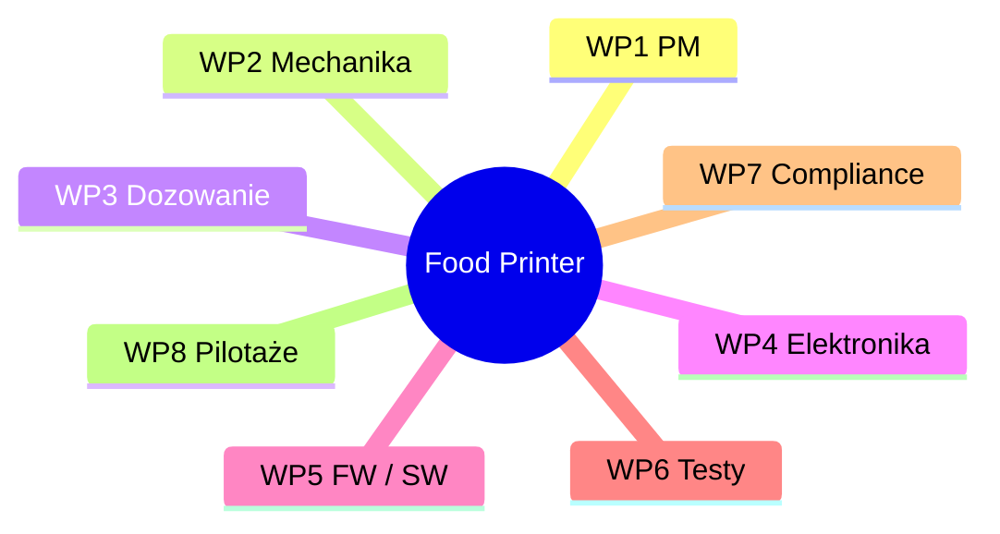

# Food Printer — od MVP do platformy „FoodOS”

---

## 1. Cel projektu i kontekst
Projekt dotyczy opracowania domowego systemu druku żywności, łączącego automatyzację przygotowania posiłków z personalizacją żywieniową. Adresuje on podstawę piramidy Maslowa (odżywianie) i bieżące problemy rynku żywności: wysoki poziom przetworzenia, marnotrawstwo, nieprzejrzyste łańcuchy dostaw oraz wzrost chorób dietozależnych. Zakładany wpływ społeczny obejmuje łatwiejszy dostęp do zdrowych, spersonalizowanych posiłków oraz redukcję odpadów i zużycia energii.

**Teza projektu:** druk żywności w warunkach domowych może być technicznie wykonalny, ekonomicznie uzasadniony i korzystny społecznie – pod warunkiem zapewnienia powtarzalności procesu, higieny (CIP) i zgodności z normami bezpieczeństwa.

  

## 2. Fazy i status

| Etap | Status | Ramy czasowe | Cel etapu (skrót) |
|------|--------|--------------|-------------------|
| **Etap 1 — PoC** | **zakończony** | 2023-10-02 → 2024-09-11 | dowód koncepcji druku naleśników w różnych kształtach/kolorach + wstępna walidacja ekonomiczna |
| **Etap 2 — MVP** | **w toku** | 2025-07-01 → 2026-04-18 | stabilne dozowanie, pieczenie warstwowe, komora klimatyczna, szybka wymiana wkładów, GUI + CIP |
| **Etap 3 — Iteracje rynkowe** | planowany | 2026-04-19 → 2026-09-15 | feedback z pilotaży, iteracje HW/SW, walidacja KPI (NPS, waste, repeatability) |
| **Etap 4 — Certyfikacja & pilotaże** | planowany | 2026-09-15 → 2027-01-13 | HACCP/CE, audyty, pilotaże w środowiskach docelowych (szkoły, HoReCa, eventy) |

## 3. Zakres rzeczowy (skrót)

### W zakresie realizacji (Etapy 1 → 4)

- **Mechanika** – konstrukcja modułowa z profili 30 × 30 mm, kinematyka **Core XY**, prowadnice liniowe, oś Z na T8/NEMA 17.  
- **Dozowanie** – pompa perystaltyczna z kompensacją pulsacji (A → wariant produkcyjny), wielokanałowa architektura z PCB sterującą (Etap 2).  
- **Pieczenie** – stół grzewczy (bottom-heating) + moduł górny (top-heating); profile termiczne sterowane PID; komora z kontrolą klimatu.  
- **Sterowanie** – płyta **BTT Octopus** + **TMC2209**, E-stop, bezpieczniki; pcb “pump-switch” dla kanałów dozowania.  
- **Oprogramowanie** – firmware, GUI (flow: wzór → kalibracja → druk → CIP), pipeline PNG/SVG → G-code, profile pieczenia.  
- **Procedury higieniczne** – design-for-cleaning, instrukcje CIP/SOP, pomiary ATP (Etap 2/3).  
- **Testy i walidacja** – powtarzalność (≤ 5 %), energia, sensoryka, NPS; walidacja MVP (Etap 2), iteracje rynkowe (Etap 3).  
- **Zgodność** – dokumentacja HACCP draft, ścieżka CE/LVD/EMC, pre-audyt (Etap 3) + pełne zgłoszenie (Etap 4).  
- **Komunikacja i pilotaże** – rendery, wideo, ankiety, raporty pilotażowe; pitch-deck i one-pager.  

### Poza zakresem (na tym etapie)

- **Produkcja wkładów w skali fabrycznej** – docelowe linie przemysłowe będą opisane w oddzielnym, prywatnym dossier.  
- **Usługi kliniczne / diagnostyczne** – wymagają certyfikowanych partnerów medycznych, nie są objęte bieżącym MVP.  
- **Integracje e-health** (np. przesyłanie danych do aplikacji medycznych) – zostaną rozważone po etapie certyfikacji i ocenie wymagań prawnych.

Zakres jest modułowy, co pozwala równolegle rozwijać mechanikę, elektronikę i software oraz przygotowywać dokumentację compliance (Etapy 3–4).

---

## 4. Rezultaty Etapu 1 (PoC)

Etap 1 udowodnił, że druk naleśników o złożonych wzorach i kolorach jest możliwy technicznie i uzasadniony kosztowo. Powstał działający prototyp, którego kluczowe elementy to:

Rama Core XY z profili aluminiowych 30 × 30 mm, gwarantująca precyzję ruchu.

Płyta BTT Octopus + sterowniki TMC2209, dające cichą pracę i sprzężenie zwrotne z driverów.

Pompa perystaltyczna (wariant A) z kompensacją pulsacji, wybrana na podstawie macierzy Pugh jako najlepszy kompromis koszt–precyzja–higiena.

Pipeline od grafiki PNG/SVG do G-code, pozwalający użytkownikowi zamienić obraz w zjadliwy wydruk.

Koszt porcji ~0,42 zł (składniki + energia), co plasuje rozwiązanie w zasięgu rynku masowego.

  

Pełna dokumentacja techniczna, pomiary pulsacji i próbki wydruków znajdują się w pliku
phases/Phase_1.md
*[Szczegóły etapu 1](phases/Phase_1.md)*

---

## 5. Architektura techniczna (skrót)

- **Mechanika** – Core XY + GT2, prowadnice liniowe, separacja stref „napęd” / „czysta”.  
- **Elektronika** – Octopus, TMC2209, czujniki T°, E-stop, bezpieczniki.  
- **Dozowanie** – pompa perystaltyczna A, 8-kanałowe PCB (Etap 2) zamiast przekaźników.  
- **Software** – firmware + GUI, generator G-code, profile termiczne.  
- **Higiena** – szybki demontaż, materiały food-grade, CIP ≤ 10 min (target).  

---

## 6. Plan prac i zarządzanie

### 6.1 Work Packages

| WP | Zakres |
|----|--------|
| **WP1** | Project Management (PM) |
| **WP2** | Mechanika |
| **WP3** | Dozowanie |
| **WP4** | Elektronika |
| **WP5** | Firmware / Software |
| **WP6** | Testy & Walidacja |
| **WP7** | Compliance (HACCP / CE) |
| **WP8** | Pilotaże & Go-to-Market |

### 6.2 Struktura WBS (mermaid mindmap)

## 7. KPI i kryteria sukcesu
- **Techniczne:** odchyłka dozowania ≤ 5%; **CIP ≤ 10 min**; awaryjność < 2% / 100 h; energia ≤ 0,1 kWh / porcję.  
- **Użytkowe:** NPS ≥ 40; czas przygotowania porcji ≤ 3 min; satysfakcja smaku ≥ 4/5.  
- **Środowiskowe:** odpad ≤ 5 g / porcję.  
- **Biznesowe:** koszt porcji konkurencyjny wobec alternatyw; ≥ 2–3 listy intencyjne na pilotaże.

---

## 8. Ryzyka i działania ograniczające
- **Higiena/CIP** — ryzyko niewystarczającej czystości; działanie: design-for-cleaning, testy ATP, materiały „food-grade”.  
- **Pulsacja przy gęstych pastach** — ryzyko jakości ścieżek; działanie: kompensacja pulsacji, profil prędkości, opcjonalne grzanie przewodów.  
- **Zgodność (HACCP/CE)** — ryzyko wydłużenia terminu; działanie: równoległy pre-audyt i wcześniejsze przygotowanie dokumentacji.  
- **Akceptacja rynku** — ryzyko niskiego NPS; działanie: iteracje menu, badania UX, materiały instruktażowe.

## 9. Struktura repozytorium publicznego (skrót)
- `tests/` — powtarzalność, energia, protokoły.  
- `docs/` — Gantt/WBS (Mermaid), macierz Pugh, zgodność (HACCP draft, ścieżka CE, GDPR/DMP).  
- `images/` — zdjęcia, rendery.  
- `phases/` — szczegółowe opisy poszczególnych faz

Szczegółowe CAD/PCB/firmware są przechowywane w repo prywatnym i udostępniane partnerom na żądanie.

