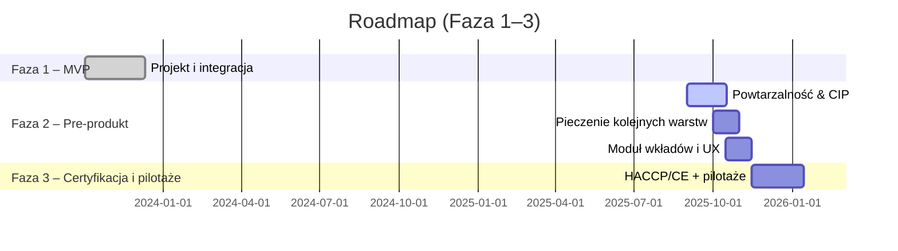
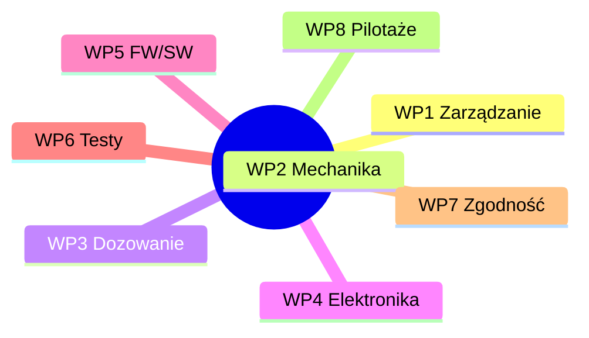

# Food Printer — od MVP do platformy „FoodOS”
*README_PL.md – wersja projektowa (zarządcza, zwięzła)*

---

## 1. Cel projektu i kontekst
Projekt dotyczy opracowania domowego systemu druku żywności, łączącego automatyzację przygotowania posiłków z personalizacją żywieniową. Adresuje on podstawę piramidy Maslowa (odżywianie) i bieżące problemy rynku żywności: wysoki poziom przetworzenia, marnotrawstwo, nieprzejrzyste łańcuchy dostaw oraz wzrost chorób dietozależnych. Zakładany wpływ społeczny obejmuje łatwiejszy dostęp do zdrowych, spersonalizowanych posiłków oraz redukcję odpadów i zużycia energii.

**Teza projektu:** druk żywności w warunkach domowych może być technicznie wykonalny, ekonomicznie uzasadniony i korzystny społecznie – pod warunkiem zapewnienia powtarzalności procesu, higieny (CIP) i zgodności z normami bezpieczeństwa.

---

## 2. Fazy i status
- **Faza 1 – Pancake Printer (PoC/MVP)** — *zakończona.* Potwierdzono wykonalność techniczną i sens ekonomiczny druku naleśników w wielu kolorach i kształtach.
- **Faza 2 – Pre-produkt** — *w toku.* Cel: zwiększenie powtarzalności, pieczenie kolejnych warstw, modernizacja wkładów i dozowania (CIP), konsultacje z użytkownikami i dobór menu startowego.
- **Faza 3 – Certyfikacja i pilotaże** — *planowana.* Pakiet HACCP/CE oraz pilotaże w wybranych lokalizacjach (szkoły, eventy, HoReCa).
- **Wizja długoterminowa – „FoodOS”** — platforma do wielu potraw, subskrypcyjny model wkładów oraz komponenty AI wspierające dobór diety, harmonogram i zakupy.

---

## 3. Zakres rzeczowy (skrót)
**W zakresie (Fazy 1–3):** mechanika (CoreXY), dozowanie (pompa perystaltyczna z kompensacją), sterowanie/GUI, generator ścieżek (PNG/SVG → G-code), proces termiczny, higiena/CIP, przygotowanie zgodności (HACCP/CE), badania użytkowników i pilotaże.  
**Poza zakresem na obecnym etapie:** zaawansowana diagnostyka medyczna oraz pełna industrializacja produkcji wkładów.

---

## 4. Rezultaty Fazy 1 (MVP)
**Mechanika:** rama z profili aluminiowych 30×30; kinematyka **CoreXY** na paskach **GT2**; oś Z: **NEMA17 + śruba trapezowa T8** (nakrętka kompensująca luz).  
**Napędy i sterowanie:** silniki **NEMA17** ze sterownikami **TMC2209** (wykorzystanie informacji zwrotnej z driverów – podejście hybrydowe), płyta główna **BTT Octopus**, autorski firmware oraz **GUI** dotykowe.  
**Proces termiczny:** elektryczny grill z kontrolą temperatury (stabilizacja wypieku ścieżek).  
**Dozowanie:** własny projekt **pompy perystaltycznej** na NEMA17; przebadano dwa warianty – **A (z kompensacją pulsacji)** i **B (bez kompensacji)**.  
**Macierz decyzji (Pugh):** porównano ślimak/extruder, tłok, perystaltyczną oraz perystaltyczną z kompensacją. Kryteria: koszt, „food-grade”, kompatybilność z systemem, precyzja dozowania, czyszczenie, czas developmentu. **Wybrano wariant A – perystaltyczną z kompensacją.**  
**Pipeline druku:** grafika (PNG/SVG) → separacja kolorów → mapowanie kanałów → **G-code** → druk.  
**Ekonomia jednostkowa (z prób):** składniki ok. **7,20 zł / 1,5 kg** ciasta; energia ok. **0,09 zł** na wydruk; **~0,34 zł / naleśnik** (założenia w arkuszu kosztów).  
**Materiały referencyjne:** demo wideo działania MVP, rendery, zdjęcia próbek druku, wyniki porównania pulsacji (A vs B), macierz Pugh.

---

## 5. Architektura techniczna (skrót)
- **Mechanika:** CoreXY/GT2, prowadnice liniowe, separacja stref napędowej i „czystej” (kontakt z żywnością).  
- **Elektronika:** BTT Octopus, TMC2209, czujniki (temperatura/pozycja), zasilanie i zabezpieczenia (E-stop, bezpieczniki).  
- **Dozowanie i kanały:** pompa perystaltyczna z kompensacją; obecnie moduł przekaźnikowy 4–8 kanałów (rozwiązanie tymczasowe), **docelowo** dedykowana płytka PCB z tranzystorami.  
- **Oprogramowanie:** firmware, GUI operatora, generator ścieżek; profile pieczenia i kalibracje.  
- **Higiena/CIP:** projekt „design-for-cleaning”, szybki demontaż, materiały dopuszczone do kontaktu z żywnością.

---

## 6. Plan prac i zarządzanie

### 6.1 Work Packages (WP)
WP1 Zarządzanie; WP2 Mechanika; WP3 Dozowanie; WP4 Elektronika/bezpieczeństwo; WP5 Firmware/Software; WP6 Testy i walidacja; WP7 Zgodność i certyfikacja; WP8 Pilotaże i wejście na rynek.

### 6.2 Harmonogram (skrót)

### 6.3 WBS (orientacyjnie)

**Proces i jakość:** repozytorium Git z szablonami Issue/PR, tablicą Kanban, przeglądami tygodniowymi, checklistami jakości i wersjonowaniem artefaktów.

---

## 7. KPI i kryteria sukcesu
- **Techniczne:** odchyłka dozowania ≤ 5%; **CIP ≤ 10 min**; awaryjność < 2% / 100 h; energia ≤ 0,1 kWh / porcję.  
- **Użytkowe:** NPS ≥ 40; czas przygotowania porcji ≤ 3 min; satysfakcja smaku ≥ 4/5.  
- **Środowiskowe:** odpad ≤ 5 g / porcję.  
- **Biznesowe:** koszt porcji konkurencyjny wobec alternatyw; ≥ 2–3 listy intencyjne na pilotaże.

---

## 8. Ryzyka i działania ograniczające
- **Higiena/CIP** — ryzyko niewystarczającej czystości; działanie: design-for-cleaning, testy ATP, materiały „food-grade”.  
- **Pulsacja przy gęstych pastach** — ryzyko jakości ścieżek; działanie: kompensacja pulsacji, profil prędkości, opcjonalne grzanie przewodów.  
- **Zgodność (HACCP/CE)** — ryzyko wydłużenia terminu; działanie: równoległy pre-audyt i wcześniejsze przygotowanie dokumentacji.  
- **Akceptacja rynku** — ryzyko niskiego NPS; działanie: iteracje menu, badania UX, materiały instruktażowe.

---

## 9. Struktura repozytorium (skrót)
- `hardware/` — CAD (STEP/STL), rysunki 2D, BOM, pompa perystaltyczna (A/B), rendery i zdjęcia.  
- `electronics/` — KiCad (schemat/PCB/Gerbery), pinout, wiązki, zabezpieczenia.  
- `firmware/`, `software/` — konfiguracja BTT Octopus/TMC2209, GUI, generator G-code (PNG/SVG → G-code).  
- `tests/` — powtarzalność, energia, protokoły.  
- `docs/` — Gantt/WBS (Mermaid), macierz Pugh, zgodność (HACCP draft, ścieżka CE, GDPR/DMP).  
- `marketing/` — demo wideo, zdjęcia, rendery.  
- `business/` — koszty jednostkowe, konkurencja, plan pilotaży.  
- `grants/` — narracje, budżety, logframe, rejestr ryzyk i wskaźniki wpływu.

---

## 10. Moduł grantowy (skrót dla wniosków)
**Cel:** zapewnić spójny pakiet aplikacyjny pod programy grantowe (np. SWPS Startup Booster for Social Impact, PARP).  
**Elementy:**
- **Narracja skrócona** (streszczenie, wpływ społeczny, plan WP, KPI).  
- **Workplan** (WP/Deliverables/Milestones).  
- **Budżet wysokiego poziomu** (personel, prototypy, zgodność, pilotaże).  
- **Logframe** (cel, rezultat, wskaźniki, źródła weryfikacji).  
- **Rejestr ryzyk** (P×I, działania ograniczające).  
- **KPI i metody pomiaru** (Repeatability, Energy, Waste, NPS, PrepTime).  
- **Etyka i GDPR/DMP** (zakres danych, zgody, retencja, bezpieczeństwo).

> Rekomendacja: każdy wniosek utrzymywać w `grants/submissions/<program>/<rok>/` wraz z załącznikami: rendery, wideo demo, listy intencyjne, CV.

---

## 11. Materiały referencyjne i media (do podlinkowania po dodaniu do repo)
- **Demo wideo MVP:** `marketing/videos/demo_phase1.mp4`  
- **Render frontu:** `marketing/images/front_render.png`  
- **Macierz Pugh (grafika):** `docs/engineering/decision_matrices/pugh_dosing.png`  
- **Zdjęcia próbek:** `marketing/photos/samples/…`  
- **Arkusz kosztów:** `business/costs/model.csv`

---

## 12. Informacja licencyjna
Proponowane licencje: **kod – MIT/Apache-2.0**, **hardware – CERN-OHL-S**, **dokumentacja – CC BY-SA**. Alternatywnie wariant „open-core” (szczegóły do określenia w dokumentacji biznesowej).

---
