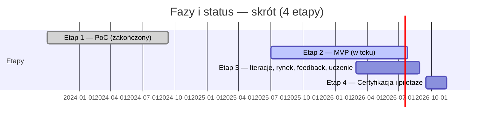

# Food Printer — od MVP do platformy „FoodOS”

---

## 1. Cel projektu i kontekst
Projekt dotyczy opracowania domowego systemu druku żywności, łączącego automatyzację przygotowania posiłków z personalizacją żywieniową. Adresuje on podstawę piramidy Maslowa (odżywianie) i bieżące problemy rynku żywności: wysoki poziom przetworzenia, marnotrawstwo, nieprzejrzyste łańcuchy dostaw oraz wzrost chorób dietozależnych. Zakładany wpływ społeczny obejmuje łatwiejszy dostęp do zdrowych, spersonalizowanych posiłków oraz redukcję odpadów i zużycia energii.

**Teza projektu:** druk żywności w warunkach domowych może być technicznie wykonalny, ekonomicznie uzasadniony i korzystny społecznie – pod warunkiem zapewnienia powtarzalności procesu, higieny (CIP) i zgodności z normami bezpieczeństwa.

---

## 2. Fazy i status

Projekt realizowany jest w czterech etapach. Każdy etap ma wyraźne cele i kryteria przejścia do kolejnej fazy.

- **Etap 1 — PoC (Proof of Concept)** — *zakończony* (2023-10-02 → 2024-09-11). Cel wykonany: techniczna wykonalność druku naleśników w różnych kolorach i kształtach oraz wstępna weryfikacja sensu ekonomicznego rozwiązania.
- **Etap 2 — MVP (Minimum Viable Product)** — *w toku* (rozpoczęcie: 2025-07-01). Cel: doprowadzenie urządzenia do stanu reprezentatywnego dla użytkownika końcowego — stabilne dozowanie, poprawiona powtarzalność, użyteczny interfejs operatora, podstawowe procedury higieniczne (CIP) i dokumentacja montażowa/serwisowa.
- **Etap 3 — Iteracje rynkowe, badania użytkowników i uczenie** — *planowany*. Cel: zbieranie feedbacku z testów użytkowników i pilotaży, iteracyjne poprawki sprzętowe i software’owe, optymalizacja menu startowego, walidacja założeń biznesowych i metryk KPI (NPS, waste, repeatability). Etap koncentruje się na szybkim cyklu „test → learn → adjust”.
- **Etap 4 — Zgodność, certyfikacja i pilotaże komercyjne** — *planowany*. Cel: przygotowanie i przeprowadzenie działań zgodnościowych (HACCP, wymagania CE/LVD/EMC tam, gdzie stosowne), finalne audyty, oraz wdrożenie pilotaży w środowiskach docelowych (szkoły, eventy, partnerzy HoReCa).

Każdy etap zamykany jest oceną kryteriów wejścia/wyjścia (exit criteria) oraz krótkim raportem technicznym i biznesowym, niezbędnym do decyzji o kontynuacji prac i ewentualnym pozyskaniu finansowania na dalsze prace.

---

---

## 3. Zakres rzeczowy (skrót)

**W zakresie realizacji (Faza 1–4):**
- Mechanika nośna i kinematyka (CoreXY, prowadnice liniowe, konstrukcja modułowa).
- System dozowania (pompa perystaltyczna z kompensacją pulsacji; architektura kanałów dozujących).
- Układ sterowania i elektronika (BTT Octopus / TMC2209; E-stop; zabezpieczenia).
- Firmware i oprogramowanie użytkownika (GUI operatora, pipeline: PNG/SVG → G-code, profile pieczenia).
- Procedury higieniczne i operacyjne (design-for-cleaning, instrukcje CIP/SOP).
- Testy i walidacja (powtarzalność dozowania, pomiary energetyczne, badania sensoryczne).
- Przygotowanie do zgodności i certyfikacji (dokumentacja HACCP draft, ścieżka CE, wymagania materiałowe).
- Materiały komunikacyjne i przygotowanie pilotaży (renderingi, wideo demo, ankiety, raporty pilotażowe).
- Pakiet grantowy (narracja, logframe, workplan, budżet wysokiego poziomu, rejestr ryzyk).

**Poza zakresem obecnych etapów (nie obejmowane w krótkim terminie):**
- Pełna, przemysłowa produkcja wkładów do żywności (skalowanie linii produkcyjnej).
- Zaawansowana diagnostyka medyczna i formalne doradztwo dietetyczne wymagające certyfikowanych usług medycznych.
- Integracja z zewnętrznymi systemami zdrowotnymi wymagającymi przekazywania danych medycznych bez odrębnych analiz prawnych i zgodności.

Zakres prac konstruowany jest modułowo, by umożliwić równoległe prowadzenie prac rozwojowych (mechanika, elektronika, software) oraz przygotowań formalnych (compliance, dokumentacja) niezbędnych dla etapów 3–4.
---

## 4. Rezultaty Fazy 1 (MVP)

Watch the video below to see first prototype in action:

  

**Mechanika:** rama z profili aluminiowych 30×30; kinematyka **CoreXY** na paskach **GT2**; oś Z: **NEMA17 + śruba trapezowa T8** (nakrętka kompensująca luz).  
**Napędy i sterowanie:** silniki **NEMA17** ze sterownikami **TMC2209** (wykorzystanie informacji zwrotnej z driverów – podejście hybrydowe), płyta główna **BTT Octopus**, autorski firmware oraz **GUI** dotykowe.  
**Proces termiczny:** elektryczny grill z kontrolą temperatury (stabilizacja wypieku ścieżek).  
**Dozowanie:** własny projekt **pompy perystaltycznej** na NEMA17; przebadano dwa warianty – **A (z kompensacją pulsacji)** i **B (bez kompensacji)**.  
**Macierz decyzji (Pugh):** porównano ślimak/extruder, tłok, perystaltyczną oraz perystaltyczną z kompensacją. Kryteria: koszt, „food-grade”, kompatybilność z systemem, precyzja dozowania, czyszczenie, czas developmentu. **Wybrano wariant A – perystaltyczną z kompensacją.**  

**Pipeline druku:** grafika (PNG/SVG) → separacja kolorów → mapowanie kanałów → **G-code** → druk.  
**Ekonomia jednostkowa (z prób):** składniki ok. **7,20 zł / 1,5 kg** ciasta; energia ok. **0,09 zł** na wydruk; **~0,42 zł / naleśnik** (założenia w tests/cost_summary.md).  
**Materiały referencyjne:** demo wideo działania MVP, rendery, zdjęcia próbek druku, wyniki porównania pulsacji (A vs B), macierz Pugh.

---

## 5. Architektura techniczna (skrót)
- **Mechanika:** CoreXY/GT2, prowadnice liniowe, separacja stref napędowej i „czystej” (kontakt z żywnością).  
- **Elektronika:** BTT Octopus, TMC2209, czujniki (temperatura/pozycja), zasilanie i zabezpieczenia (E-stop, bezpieczniki).  
- **Dozowanie i kanały:** pompa perystaltyczna z kompensacją; obecnie moduł przekaźnikowy 4–8 kanałów (rozwiązanie tymczasowe), **docelowo** dedykowana płytka PCB z tranzystorami.  
- **Oprogramowanie:** firmware, GUI operatora, generator ścieżek; profile pieczenia i kalibracje.  
- **Higiena/CIP:** projekt „design-for-cleaning”, szybki demontaż, materiały dopuszczone do kontaktu z żywnością.

[Szczegóły etapu 1](phases/Phase_1)

---

## 6. Plan prac i zarządzanie

### 6.1 Work Packages (WP)
WP1 Zarządzanie; WP2 Mechanika; WP3 Dozowanie; WP4 Elektronika/bezpieczeństwo; WP5 Firmware/Software; WP6 Testy i walidacja; WP7 Zgodność i certyfikacja; WP8 Pilotaże i wejście na rynek.

### 6.2 Harmonogram (skrót)

### 6.3 WBS (orientacyjnie)

**Proces i jakość:** repozytorium Git z szablonami Issue/PR, tablicą Kanban, przeglądami tygodniowymi, checklistami jakości i wersjonowaniem artefaktów.

---

## 7. KPI i kryteria sukcesu
- **Techniczne:** odchyłka dozowania ≤ 5%; **CIP ≤ 10 min**; awaryjność < 2% / 100 h; energia ≤ 0,1 kWh / porcję.  
- **Użytkowe:** NPS ≥ 40; czas przygotowania porcji ≤ 3 min; satysfakcja smaku ≥ 4/5.  
- **Środowiskowe:** odpad ≤ 5 g / porcję.  
- **Biznesowe:** koszt porcji konkurencyjny wobec alternatyw; ≥ 2–3 listy intencyjne na pilotaże.

---

## 8. Ryzyka i działania ograniczające
- **Higiena/CIP** — ryzyko niewystarczającej czystości; działanie: design-for-cleaning, testy ATP, materiały „food-grade”.  
- **Pulsacja przy gęstych pastach** — ryzyko jakości ścieżek; działanie: kompensacja pulsacji, profil prędkości, opcjonalne grzanie przewodów.  
- **Zgodność (HACCP/CE)** — ryzyko wydłużenia terminu; działanie: równoległy pre-audyt i wcześniejsze przygotowanie dokumentacji.  
- **Akceptacja rynku** — ryzyko niskiego NPS; działanie: iteracje menu, badania UX, materiały instruktażowe.

---

## 9. Struktura repozytorium (skrót)
- `hardware/` — CAD (STEP/STL), rysunki 2D, BOM, pompa perystaltyczna (A/B), rendery i zdjęcia.  
- `electronics/` — KiCad (schemat/PCB/Gerbery), pinout, wiązki, zabezpieczenia.  
- `firmware/`, `software/` — konfiguracja BTT Octopus/TMC2209, GUI, generator G-code (PNG/SVG → G-code).  
- `tests/` — powtarzalność, energia, protokoły.  
- `docs/` — Gantt/WBS (Mermaid), macierz Pugh, zgodność (HACCP draft, ścieżka CE, GDPR/DMP).  
- `marketing/` — demo wideo, zdjęcia, rendery.  
- `business/` — koszty jednostkowe, konkurencja, plan pilotaży.  
- `grants/` — narracje, budżety, logframe, rejestr ryzyk i wskaźniki wpływu.

---

## 10. Moduł grantowy (skrót dla wniosków)
**Cel:** zapewnić spójny pakiet aplikacyjny pod programy grantowe (np. SWPS Startup Booster for Social Impact, PARP).  
**Elementy:**
- **Narracja skrócona** (streszczenie, wpływ społeczny, plan WP, KPI).  
- **Workplan** (WP/Deliverables/Milestones).  
- **Budżet wysokiego poziomu** (personel, prototypy, zgodność, pilotaże).  
- **Logframe** (cel, rezultat, wskaźniki, źródła weryfikacji).  
- **Rejestr ryzyk** (P×I, działania ograniczające).  
- **KPI i metody pomiaru** (Repeatability, Energy, Waste, NPS, PrepTime).  
- **Etyka i GDPR/DMP** (zakres danych, zgody, retencja, bezpieczeństwo).

> Rekomendacja: każdy wniosek utrzymywać w `grants/submissions/<program>/<rok>/` wraz z załącznikami: rendery, wideo demo, listy intencyjne, CV.

---

## 11. Materiały referencyjne i media (do podlinkowania po dodaniu do repo)
- **Demo wideo MVP:** `marketing/videos/demo_phase1.mp4`  
- **Render frontu:** `marketing/images/front_render.png`  
- **Macierz Pugh (grafika):** `docs/engineering/decision_matrices/pugh_dosing.png`  
- **Zdjęcia próbek:** `marketing/photos/samples/…`  
- **Arkusz kosztów:** `business/costs/model.csv`

---

## 12. Informacja licencyjna
Proponowane licencje: **kod – MIT/Apache-2.0**, **hardware – CERN-OHL-S**, **dokumentacja – CC BY-SA**. Alternatywnie wariant „open-core” (szczegóły do określenia w dokumentacji biznesowej).

---
