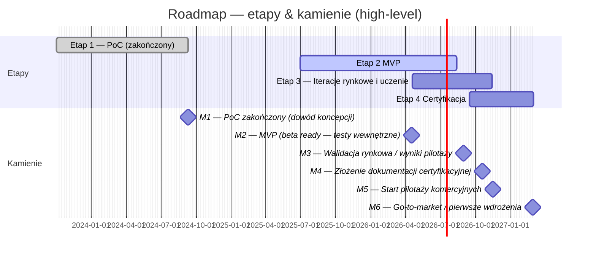
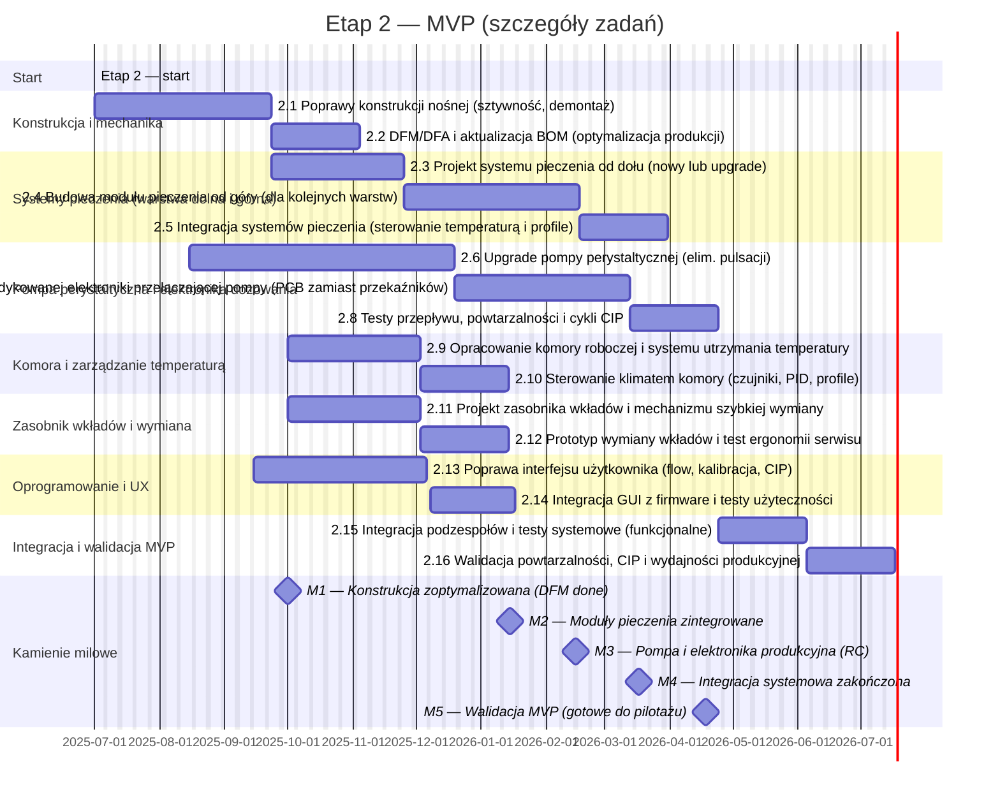

## Harmonogram ogólny

```mermaid
gantt
  title Roadmap — etapy & kamienie (high-level)
  dateFormat YYYY-MM-DD
  excludes  weekends

  section Etapy
  Etap 1 — PoC (zakończony)              :done,    2023-10-02, 2024-09-11
  Etap 2 MVP                             :active,  2025-07-01, 292d
  Etap 3 — Iteracje rynkowe i uczenie    :         2026-04-19, 150d
  Etap 4 Certyfikacja                    :         2026-09-15, 120d

  section Kamienie
  M1 — PoC zakończony (dowód koncepcji)        :milestone, m1, 2024-09-11, 0d
  M2 — MVP (beta ready — testy wewnętrzne)     :milestone, m2, 2026-04-18, 0d
  M3 — Walidacja rynkowa / wyniki pilotaży     :milestone, m3, 2026-09-01, 0d
  M4 — Złożenie dokumentacji certyfikacyjnej   :milestone, m4, 2026-10-20, 0d
  M5 — Start pilotaży komercyjnych             :milestone, m5, 2026-11-15, 0d
  M6 — Go-to-market / pierwsze wdrożenia       :milestone, m6, 2027-03-01, 0d
```

## Harmonogram fazy 2

```mermaid
gantt
  title Etap 2 — MVP (szczegóły zadań)
  dateFormat  YYYY-MM-DD
  excludes    weekends

  section Start
  Etap 2 — start                             :active, start2, 2025-07-01, 0d

  section Konstrukcja i mechanika
  2.1 Poprawy konstrukcji nośnej (sztywność, demontaż) :konstr, 2025-07-01, 60d
  2.2 DFM/DFA i aktualizacja BOM (optymalizacja produkcji) :after konstr, 30d

  section Systemy pieczenia (warstwa dolna i górna)
  2.3 Projekt systemu pieczenia od dołu (nowy lub upgrade) :bake_bottom, after konstr, 45d
  2.4 Budowa modułu pieczenia od góry (dla kolejnych warstw) :bake_top, after bake_bottom, 60d
  2.5 Integracja systemów pieczenia (sterowanie temperaturą i profile) :bake_int, after bake_top, 30d

  section Pompa perystaltyczna i elektronika dozowania
  2.6 Upgrade pompy perystaltycznej (elim. pulsacji)    :pump_upg, 2025-08-15, 90d
  2.7 Projekt i produkcja dedykowanej elektroniki przełączającej pompy (PCB zamiast przekaźników) :pump_elec, after pump_upg, 60d
  2.8 Testy przepływu, powtarzalności i cykli CIP       :pump_test, after pump_elec, 30d

  section Komora i zarządzanie temperaturą
  2.9 Opracowanie komory roboczej i systemu utrzymania temperatury :chamber, 2025-10-01, 45d
  2.10 Sterowanie klimatem komory (czujniki, PID, profile) :chamber_ctrl, after chamber, 30d

  section Zasobnik wkładów i wymiana
  2.11 Projekt zasobnika wkładów i mechanizmu szybkiej wymiany :cartridge, 2025-10-01, 45d
  2.12 Prototyp wymiany wkładów i test ergonomii serwisu :cartridge_test, after cartridge, 30d

  section Oprogramowanie i UX
  2.13 Poprawa interfejsu użytkownika (flow, kalibracja, CIP) :ui, 2025-09-15, 60d
  2.14 Integracja GUI z firmware i testy użyteczności       :ui_test, after ui, 30d

  section Integracja i walidacja MVP
  2.15 Integracja podzespołów i testy systemowe (funkcjonalne) :integration, after pump_test, 30d
  2.16 Walidacja powtarzalności, CIP i wydajności produkcyjnej :validation, after integration, 30d

  section Kamienie milowe
  M1 — Konstrukcja zoptymalizowana (DFM done)              :milestone, m1, 2025-10-01, 0d
  M2 — Moduły pieczenia zintegrowane                       :milestone, m2, 2026-01-15, 0d
  M3 — Pompa i elektronika produkcyjna (RC)                :milestone, m3, 2026-02-15, 0d
  M4 — Integracja systemowa zakończona                     :milestone, m4, 2026-03-17, 0d
  M5 — Walidacja MVP (gotowe do pilotażu)                  :milestone, m5, 2026-04-18, 0d
```
