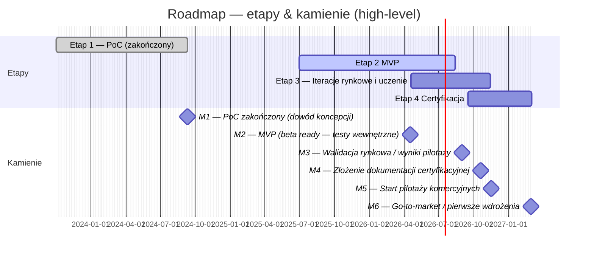

```mermaid
gantt
  title Roadmap — etapy & kamienie (high-level)
  dateFormat YYYY-MM-DD
  excludes  weekends

  section Etapy
  Etap 1 — PoC (zakończony)              :done,    2023-10-02, 2024-09-11
  Etap 2 MVP                             :active,  2025-07-01, 292d
  Etap 3 — Iteracje rynkowe i uczenie    :         2026-04-19, 150d
  Etap 4 Certyfikacja                    :         2026-09-15, 120d

  section Kamienie
  M1 — PoC zakończony (dowód koncepcji)        :milestone, m1, 2024-09-11, 0d
  M2 — MVP (beta ready — testy wewnętrzne)     :milestone, m2, 2026-04-18, 0d
  M3 — Walidacja rynkowa / wyniki pilotaży     :milestone, m3, 2026-09-01, 0d
  M4 — Złożenie dokumentacji certyfikacyjnej   :milestone, m4, 2026-10-20, 0d
  M5 — Start pilotaży komercyjnych             :milestone, m5, 2026-11-15, 0d
  M6 — Go-to-market / pierwsze wdrożenia       :milestone, m6, 2027-03-01, 0d
```
