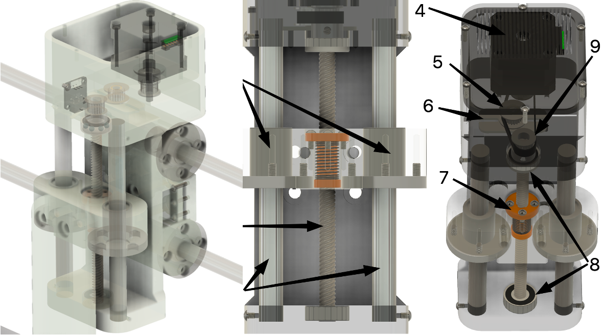
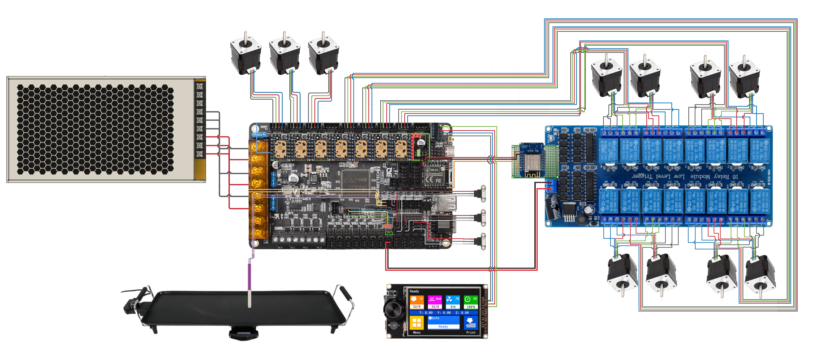
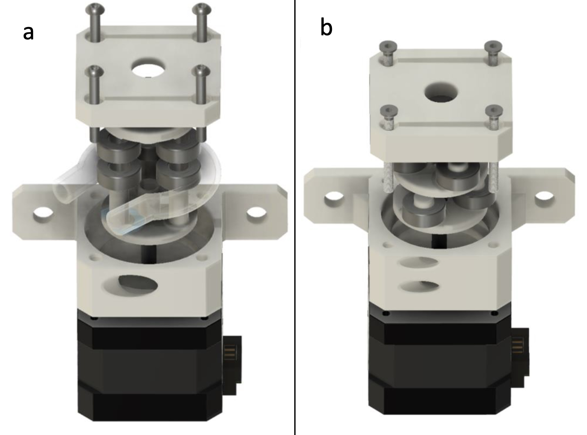
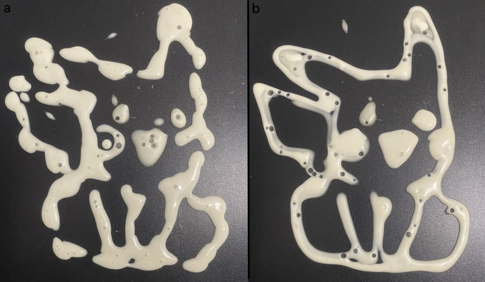

# Phase 1 — PoC (Proof of Concept)

> Dokument techniczny opisujący wyniki i założenia techniczne etapu 1 (PoC) projektu **Food Printer**.  
> Zawiera skrót rozwiązań mechanicznych, elektronicznych, sterowania i wyników testów demonstracyjnych.

---

  
  

**Demo wideo (Prototype 1):**

  

---

## 1. Cel etapu 1
Celem fazy 1 było:
- Potwierdzenie technicznej wykonalności druku naleśników o wielokolorowych wzorach i zdefiniowanych kształtach.
- Weryfikacja podstawowych rozwiązań mechanicznych i dozowania (pompa perystaltyczna).
- Zebranie danych kosztowych i energetycznych dla wyceny porcji.
- Przygotowanie materiałów i artefaktów (zdjęcia, rendery, wideo) do komunikacji projektu i wstępnych wniosków grantowych.

---

## 2. Najważniejsze rezultaty
- Działający prototyp drukarki potraw (naleśników) — pipeline: grafika (PNG/SVG) → separacja kolorów → mapowanie na kanały → G-code → druk.
- Autorski moduł dozowania: pompa perystaltyczna w dwóch wariantach (A — z kompensacją pulsacji; B — bez kompensacji). Wstępne testy wykazały wyraźne zalety wariantu A dla precyzji dozowania.
- Wynik ekonomiczny (przykładowy): koszt surowcowy ~0,34 zł / porcję (70 g), koszt energii ~0,09 zł / porcję, koszt całkowity ~0,42 zł / porcję (bez amortyzacji i kosztów operacyjnych).
- Zestaw artefaktów: zdjęcia, rendery, dokumentacja wejściowa do macierzy decyzyjnej (Pugh), wykresy wyników pomp.

---

## 3. Specyfikacja techniczna — mechanika

### 3.1 Rama i kinematyka
- Konstrukcja ramy: profile aluminiowe 30 × 30 mm (modułowa, łatwa do demontażu).
- Kinematyka: **CoreXY** z pasami **GT2** — pozwala na szybkie i precyzyjne ruchy XY przy stosunkowo prostym układzie mechanicznym.
- Separacja stref: układ napędowy i elektronika umieszczone w strefie „brudnej”, oddzielonej od strefy kontaktu z żywnością (łatwy demontaż i czyszczenie).

### 3.2 Oś Z i elementy napędu

  
  

Elementy osi Z (opis na zdjęciu):
1. prowadnice liniowe (linear bearings)  
2. śruba trapezowa T8 (trapezoidal screw)  
3. prowadnice liniowe / szyny (linear guides)  
4. silnik krokowy NEMA17  
5. napinacz paska / idler gear  
6. napinacz paska (belt tensioner)  
7. nakrętka kompensująca luz (backlash compensating nut)  
8. łożyska prowadzące śrubę trapezową  
9. koło napędowe dla śruby trapezowej

Konstrukcja osi Z zapewnia stabilność i powtarzalność pozycji, co jest istotne przy warstwowym wypieku/kontrolowanym nakładaniu masy.

---

## 4. Elektronika i sterowanie

### 4.1 Schemat ogólny

  
  

Główne elementy:
- Płyta główna: **BTT Octopus** (konfiguracja CoreXY, dużo wejść/wyjść).
- Sterowniki silników: **TMC2209** (cicha praca; wykorzystano możliwość sprzężenia zwrotnego z driverów → hybrydowy tryb sterowania).
- Silniki: **NEMA17** dla osi i do napędu pompy perystaltycznej.
- Sekcja zasilania: zasilacz impulsowy dobrany do obciążenia napędów oraz grzałki stołu.
- Bezpieczeństwo: E-stop, bezpieczniki, soft limits w firmware.

### 4.2 Układ dozowania i kanały
- Dozowanie zrealizowano przy użyciu perystaltycznej pompy własnego projektu; pompa napędzana NEMA17.
- System multi-kanałowy (aktualnie rozwiązanie z przekaźnikiem 4→8 kanałów jako prototyp; docelowo dedykowana płytka PCB z tranzystorami i zabezpieczeniami).
- Interfejs software’owy umożliwia mapowanie kanałów barw na dozatory.

---

## 5. Peristaltic pump — opis i wyniki testów

  
  

- Warianty testowane:
  - **A — pompa bez kompensacji** (prostsza konstrukcja).
  - **B — pompa z kompensacją pulsacji** (mechanizm kompensujący skokowe podania płynu),
- Kryteria oceny: precyzja dawkowania, pulsacja (stabilność przepływu), łatwość czyszczenia, koszt wykonania, kompatybilność z materiałami food-grade.
- Wynik: wariant **B** uzyskał najlepszy bilans punktów w macierzy decyzyjnej (Pugh) — lepsza powtarzalność i jakość ścieżek; wariant A prostszy i tańszy, ale gorszy dla gęstszych mieszanek.

Przykładowe zdjęcia porównawcze wyników dozowania / ścieżek:  

  
  

---

## 6. Firmware i oprogramowanie
- Firmware: konfiguracja BTT Octopus dostosowana pod CoreXY + ustawienia TMC2209. Implementacja profili osi, endstopów i bezpieczeństwa.
- Generator ścieżek: narzędzie konwertujące PNG/SVG → warstwy kolorów → ścieżki i G-code. Umożliwia mapowanie kolorów na niezależne kanały dozujące.
- GUI operatora: ekran dotykowy z możliwością wyboru pliku, profilu pieczenia, kalibracji i uruchomienia procedur CIP.
- Logowanie i telemetria: podstawowe logi produkcji (czas, zużycie energii, identyfikator wzoru) zapisywane lokalnie; projekt przewiduje późniejszą opcję anonimowej agregacji danych do celów uczenia.

---

## 7. Testy, metryki i ekonomia jednostkowa

### 7.1 Energia
- Założenia: cena 1 kWh = 0,75 zł; moc urządzenia przy pracy grzałki i napędach ≈ 2,35 kW; czas typowy wydruku ≈ 0,05 h (3 min).
- Zużycie energii ≈ 0,1175 kWh → koszt ≈ 0,09 zł / wydruk.

### 7.2 Koszty surowcowe (przykład)
- Przepis (całość): koszty składników ≈ 7,20 zł przy masie 1,5 kg → koszt/g ≈ 0,0048 zł/g.
- Przykładowa porcja 70 g → koszt surowcowy ≈ 0,34 zł.
- Całkowity koszt porcji (surowce + energia) ≈ **0,42 zł** (bez kosztów amortyzacji, wkładów eksploat., pracy).

### 7.3 Powtarzalność i jakość
- Wstępne testy wykazały dobrą powtarzalność przy użyciu pompy z kompensacją; pulsacja mniej widoczna na ścieżkach, mniejsze różnice masy porcji.
- Dalsze testy będą skupiać się na statystyce powtarzalności (odchylenie względne), czasie CIP, oraz ocenie sensorycznej (smak, tekstura).

---

