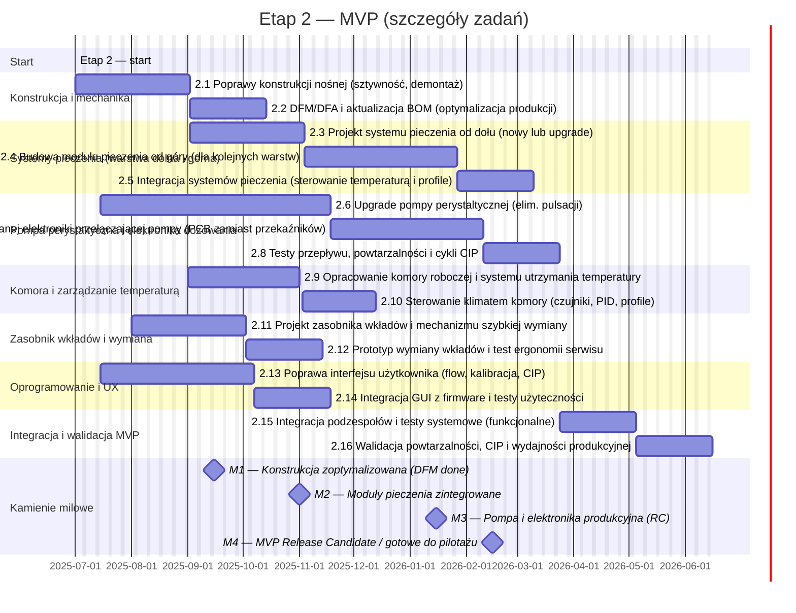

```mermaid
gantt
  title Etap 2 — MVP (szczegóły zadań)
  dateFormat  YYYY-MM-DD
  excludes    weekends

  section Start
  Etap 2 — start                             :active, start2, 2025-07-01, 0d

  section Konstrukcja i mechanika
  2.1 Poprawy konstrukcji nośnej (sztywność, demontaż) :konstr, 2025-07-01, 45d
  2.2 DFM/DFA i aktualizacja BOM (optymalizacja produkcji) :after konstr, 30d

  section Systemy pieczenia (warstwa dolna i górna)
  2.3 Projekt systemu pieczenia od dołu (nowy lub upgrade) :bake_bottom, after konstr, 45d
  2.4 Budowa modułu pieczenia od góry (dla kolejnych warstw) :bake_top, after bake_bottom, 60d
  2.5 Integracja systemów pieczenia (sterowanie temperaturą i profile) :bake_int, after bake_top, 30d

  section Pompa perystaltyczna i elektronika dozowania
  2.6 Upgrade pompy perystaltycznej (elim. pulsacji)    :pump_upg, 2025-07-15, 90d
  2.7 Projekt i produkcja dedykowanej elektroniki przełączającej pompy (PCB zamiast przekaźników) :pump_elec, after pump_upg, 60d
  2.8 Testy przepływu, powtarzalności i cykli CIP       :pump_test, after pump_elec, 30d

  section Komora i zarządzanie temperaturą
  2.9 Opracowanie komory roboczej i systemu utrzymania temperatury :chamber, 2025-09-01, 45d
  2.10 Sterowanie klimatem komory (czujniki, PID, profile) :chamber_ctrl, after chamber, 30d

  section Zasobnik wkładów i wymiana
  2.11 Projekt zasobnika wkładów i mechanizmu szybkiej wymiany :cartridge, 2025-08-01, 45d
  2.12 Prototyp wymiany wkładów i test ergonomii serwisu :cartridge_test, after cartridge, 30d

  section Oprogramowanie i UX
  2.13 Poprawa interfejsu użytkownika (flow, kalibracja, CIP) :ui, 2025-07-15, 60d
  2.14 Integracja GUI z firmware i testy użyteczności       :ui_test, after ui, 30d

  section Integracja i walidacja MVP
  2.15 Integracja podzespołów i testy systemowe (funkcjonalne) :integration, after pump_test, 30d
  2.16 Walidacja powtarzalności, CIP i wydajności produkcyjnej :validation, after integration, 30d

  section Kamienie milowe
  M1 — Konstrukcja zoptymalizowana (DFM done)              :milestone, m1, 2025-09-15, 0d
  M2 — Moduły pieczenia zintegrowane                        :milestone, m2, 2025-11-01, 0d
  M3 — Pompa i elektronika produkcyjna (RC)                 :milestone, m3, 2026-01-15, 0d
  M4 — MVP Release Candidate / gotowe do pilotażu          :milestone, m4, 2026-02-15, 0d
```
