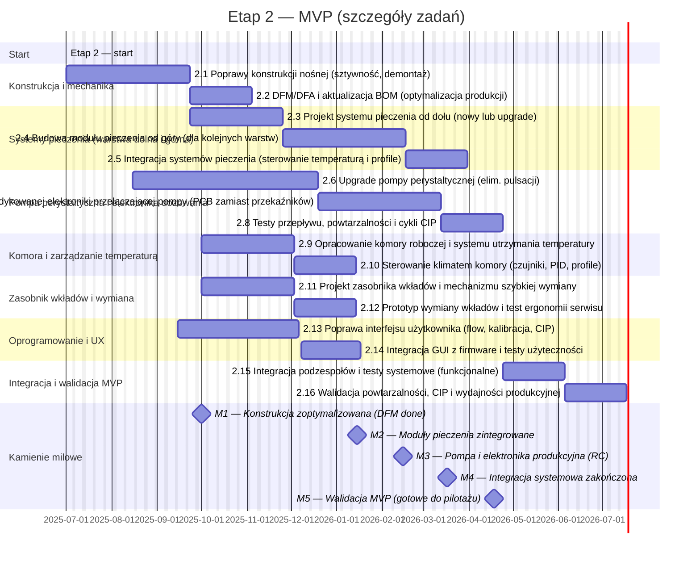
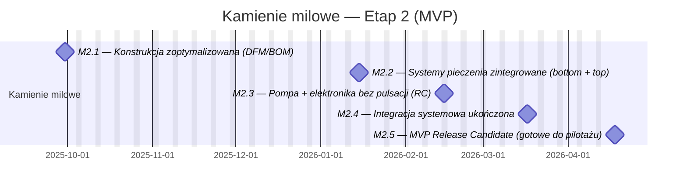

# Phase 2 — MVP (rozwój i stabilizacja)

**Cel dokumentu:** szczegółowy opis zakresu, zadań, kryteriów akceptacji i dostaw dla Etapu 2 (MVP). Dokument służy jako odniesienie dla zespołu technicznego, QA oraz interesariuszy grantowych/pilotażowych.

---
Harmonogram 

## 1. Streszczenie etapu
Etap 2 ma doprowadzić PoC do poziomu MVP zdolnego do testów użytkowych i wstępnych pilotaży. Priorytety: powtarzalność dozowania, niezawodny system pieczenia wielowarstwowy, ergonomiczny i bezpieczny system wymiany wkładów, kultura czyszczenia (CIP), stabilna elektronika sterująca wielokanałowym dozowaniem oraz użyteczny interfejs operatora.

Główne cele:
- Eliminacja pulsacji dawkowania (pompa perystaltyczna).
- Opracowanie i integracja systemów grzewczych (od dołu i górny moduł dla warstw).
- Zaprojektowanie komory roboczej z precyzyjnym utrzymaniem temperatury.
- Ulepszenie mechaniki nośnej dla stabilności i serwisu.
- Stworzenie dedykowanej elektroniki do przełączania i sterowania pompami.
- Poprawa UX i integracja firmware ↔ hardware.

---

## 2. Zakres (wysoki poziom)
W etapie 2 realizujemy:
- prace mechaniczne (wzmocnienia, DFM/DFA),
- projekt i prototypowanie systemów pieczenia (dolny i górny),
- modernizację i testy pompy perystaltycznej (wariant A → produkcyjny),
- projekt PCB sterującej układem dozowania (zastąpienie przekaźników),
- zaprojektowanie komory roboczej i systemu kontroli temperatury,
- projekt zasobnika wkładów i mechanizmu szybkiej wymiany,
- rozwój GUI (flow operatora, procedury CIP),
- integracja i walidacja systemu oraz przygotowanie RC (Release Candidate).

**Poza zakresem:** szczegółowa skala produkcyjna wkładów, integracja z systemami medycznymi, certyfikacja końcowa (przygotowanie do certyfikacji jest w zakresie — same certyfikaty w Etapie 4).

---

## 3. Zadania (szczegółowo, zgodnie z harmonogramem)

Terminy i zależności odpowiadają diagramowi Mermaid (start 2025-07-01). Zadania „after …” ruszają po zakończeniu poprzedników.

| Nr | Nazwa zadania | Okres | Zakres (skrót) | Główny rezultat |
|----|---------------|-------|----------------|-----------------|
| **2.1** | Poprawy konstrukcji nośnej | 2025-07-01 → 2025-08-30 (60 d) | Sztywność, redukcja rezonansów, tool-less demontaż | Eksporty CAD, test sztywności |
| **2.2** | DFM/DFA + aktualizacja BOM | 2025-08-31 → 2025-09-29 (30 d) | Analiza produkcyjna, standaryzacja części | BOM.csv, notatka DFM |
| **2.3** | System pieczenia od dołu | 2025-08-31 → 2025-10-14 (45 d) | Nowy/upgrade grzanego stołu, czujniki | Schemat grzałek, prototyp |
| **2.4** | Moduł pieczenia od góry | 2025-10-15 → 2025-12-13 (60 d) | Projekt/punktowe grzanie górne | Prototyp top-heating |
| **2.5** | Integracja systemów pieczenia | 2025-12-14 → 2026-01-13 (30 d) | PID, profile temperaturowe | Firmware patch, raport termiczny |
| **2.6** | Upgrade pompy perystaltycznej | 2025-08-15 → 2025-11-13 (90 d) | Eliminacja pulsacji | CAD vA, wykresy Q=f(rpm) |
| **2.7** | PCB sterująca kanałami pompy | 2025-11-14 → 2026-01-12 (60 d) | Projekt/produkcja PCB | Gerbery + testy |
| **2.8** | Testy przepływu / CIP | 2026-01-13 → 2026-02-11 (30 d) | Powtarzalność, statystyka, CIP | Raport porównawczy |
| **2.9** | Komora robocza (mechanika) | 2025-10-01 → 2025-11-14 (45 d) | Izolacja, przepływ powietrza | CAD komory |
| **2.10**| Sterowanie klimatem komory | 2025-11-15 → 2025-12-14 (30 d) | Czujniki, PID, profile | Logi testów termicznych |
| **2.11**| Zasobnik wkładów (projekt) | 2025-10-01 → 2025-11-14 (45 d) | Ergonomia, blokady | CAD zasobnika |
| **2.12**| Prototyp wymiany wkładów | 2025-11-15 → 2025-12-14 (30 d) | Test czasu wymiany, ergonomia | Raport ergonomii |
| **2.13**| Poprawa GUI (flow, CIP) | 2025-09-15 → 2025-11-13 (60 d) | Redesign UI, prototypy | Mock-upy |
| **2.14**| Integracja GUI + testy UX | 2025-11-14 → 2025-12-13 (30 d) | Implementacja na urządzeniu | Raport użyteczności |
| **2.15**| Integracja systemowa | 2026-02-12 → 2026-03-13 (30 d) | Montaż wszystkich modułów, testy E2E | Raport integracyjny |
| **2.16**| Walidacja MVP | 2026-03-14 → 2026-04-12 (30 d) | Powtarzalność, CIP, wydajność | Raport walidacyjny |

---

## 4. Kryteria akceptacji (exit criteria)

Ogólne: pełna dokumentacja testów w repo (publiczne podsumowania, szczegóły w repo prywatnym); artefakty składające się na dostawy D2.\*.

### Powiązanie z kamieniami milowymi

| Zadania | Kryterium / metryka | Kamień milowy (data) |
|---------|--------------------|----------------------|
| 2.1-2.2 | Raport DFM + BOM zatwierdzone; poprawa sztywności ≥ X % | **M2.1 — 2025-09-30** |
| 2.3-2.5 | Stabilność temp. ±2 °C, równomierny wypiek ≥ 80 % prób | **M2.2 — 2026-01-15** |
| 2.6-2.8 | CV porcji ≤ 5 %, PCB pompy przechodzi testy EMI/CIP | **M2.3 — 2026-02-15** |
| 2.15 | Testy E2E bez kryt. defektów, raport integracyjny OK | **M2.4 — 2026-03-17** |
| 2.16 | Powtarzalność ≤ 5 %, CIP ≤ 10 min, GUI task-success ≥ 90 % | **M2.5 — 2026-04-18** |

---

## 5. Kamienie milowe (Mermaid)

