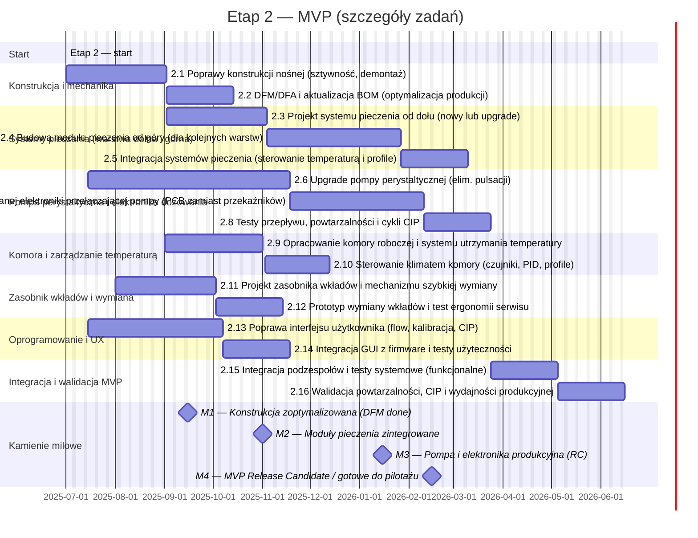

# Phase 2 — MVP (rozwój i stabilizacja)

**Cel dokumentu:** szczegółowy opis zakresu, zadań, kryteriów akceptacji i dostaw dla Etapu 2 (MVP). Dokument służy jako odniesienie dla zespołu technicznego, QA oraz interesariuszy grantowych/pilotażowych.

---

## 1. Streszczenie etapu
Etap 2 ma doprowadzić PoC do poziomu MVP zdolnego do testów użytkowych i wstępnych pilotaży. Priorytety: powtarzalność dozowania, niezawodny system pieczenia wielowarstwowy, ergonomiczny i bezpieczny system wymiany wkładów, kultura czyszczenia (CIP), stabilna elektronika sterująca wielokanałowym dozowaniem oraz użyteczny interfejs operatora.

Główne cele:
- Eliminacja pulsacji dawkowania (pompa perystaltyczna).
- Opracowanie i integracja systemów grzewczych (od dołu i górny moduł dla warstw).
- Zaprojektowanie komory roboczej z precyzyjnym utrzymaniem temperatury.
- Ulepszenie mechaniki nośnej dla stabilności i serwisu.
- Stworzenie dedykowanej elektroniki do przełączania i sterowania pompami.
- Poprawa UX i integracja firmware ↔ hardware.

---

## 2. Zakres (wysoki poziom)
W etapie 2 realizujemy:
- prace mechaniczne (wzmocnienia, DFM/DFA),
- projekt i prototypowanie systemów pieczenia (dolny i górny),
- modernizację i testy pompy perystaltycznej (wariant A → produkcyjny),
- projekt PCB sterującej układem dozowania (zastąpienie przekaźników),
- zaprojektowanie komory roboczej i systemu kontroli temperatury,
- projekt zasobnika wkładów i mechanizmu szybkiej wymiany,
- rozwój GUI (flow operatora, procedury CIP),
- integracja i walidacja systemu oraz przygotowanie RC (Release Candidate).

**Poza zakresem:** szczegółowa skala produkcyjna wkładów, integracja z systemami medycznymi, certyfikacja końcowa (przygotowanie do certyfikacji jest w zakresie — same certyfikaty w Etapie 4).

---

## 3. Zadania (zwięzły opis)
> Uporządkowane priorytetowo; prace mogą być prowadzone równolegle tam, gdzie to możliwe.

1. **Poprawy konstrukcji nośnej**
   - Wzmocnienie punktów montażowych, redukcja rezonansów, ułatwienie demontażu modułów.
   - DFM/DFA i aktualizacja BOM.

2. **System pieczenia — dolny**
   - Upgrade lub nowy projekt elementu grzewczego stołu (stabilność temperatury, uniformizacja).
   - Integracja z profilem G-code.

3. **System pieczenia — górny moduł**
   - Projekt modułu grzewczego/nagrzewania od góry dla kolejnych warstw (kontrola punktowa/panelowa).

4. **Komora robocza i kontrola klimatu**
   - Konstrukcja komory, cyrkulacja powietrza, izolacja termiczna, czujniki.
   - Sterowanie PID, profile temperaturowe.

5. **Upgrade pompy perystaltycznej**
   - Mechaniczne i sterownicze zmiany eliminujące pulsacje (różne strategie: mechaniczne tłumiki, multiple-diaphragm, rotor geometry).
   - Testy Q = f(rpm), testy powtarzalności dozowania.

6. **Elektronika sterująca pompami**
   - Projekt PCB przełączającej kanały (MOSFET, sterowanie PWM, zabezpieczenia, optoizolacja).
   - Integracja komunikacyjna z BTT Octopus / firmware.

7. **Zasobnik wkładów i mechanizm wymiany**
   - Ergonomia, blokady, uszczelnienia, procedura wymiany (bez narzędzi / szybki zamek).

8. **GUI / UX**
   - Przepływ operatora (wybór wzoru, kalibracja, CIP), makiety, testy użyteczności.

9. **Integracja systemowa i walidacja**
   - Testy systemowe (funkcjonalne, powtarzalność, CIP), przygotowanie Release Candidate.

---

## 4. Kryteria akceptacji (exit criteria)
Każde zadanie ma mierzalne kryteria. Główne wymogi etapu:

- **Powtarzalność dozowania:** odchylenie względne ≤ **5%** dla prób n≥30 porcji przy defin. lepkości (profil testowy).
- **Pulsacja:** subiektywna ocena wizualna + analiza masy porcji — wariant produkcyjny wykazuje istotną redukcję pulsacji względem wariantu B (metryka: CV przepływu ≤ zadanej wartości).
- **Stabilność temperatury:** komora / stół utrzymuje zadane profile ± **2°C** przez czas procesu.
- **CIP (czas i skuteczność):** pełna procedura czyszczenia i dezynfekcji dla modułów kontaktu z żywnością ≤ **10 min** (po demontażu/minimalna operacja).
- **Interfejs:** task success ≥ **90%** w testach użyteczności (podstawowe scenariusze: wybór wzoru, uruchomienie, czyszczenie).
- **Bezpieczeństwo elektryczne (pre-test):** brak krytycznych przekroczeń; podstawowe testy izolacji i ochrony przed przeciążeniem.
- **RC readiness:** integracja modułów, raport integracyjny i zestaw testów akceptowanych przez PM.

---

## 5. Kamienie milowe i dostawy
Dostawy etapu i kamienie milowe (przykładowe nazwy plików):

- **D2.1** — Zaktualizowana dokumentacja mechaniczna (CAD-export + BOM) `hardware/phase2/mech_export.zip`
- **D2.2** — Prototyp/raport systemu pieczenia (dolny) `docs/thermal/bake_bottom_report.pdf`
- **D2.3** — Prototyp modułu pieczenia górnego `hardware/phase2/bake_top_thumbnail.png`
- **D2.4** — Pompa (CAD + testy) `hardware/pump/pump_vA_report.pdf`
- **D2.5** — PCB sterująca pompami (schemat + gerbers) — do repo prywatnego; w publicznym repo: `electronics/pump_controller_summary.md`
- **D2.6** — Prototyp zasobnika wkładów + instrukcja wymiany `hardware/cartridge/README.md`
- **D2.7** — GUI mockups i firmware integration `software/gui/README.md`
- **D2.RC** — Release Candidate — pakiet integracyjny (raport integracyjny + zestaw testów) `releases/RC_phase2_v1.zip`

**Kamienie milowe (milestones):**
- **M2.1** — Konstrukcja zoptymalizowana (DFM done)  
- **M2.2** — Moduły pieczenia zintegrowane i przetestowane termicznie  
- **M2.3** — Pompa i elektronika sterująca przeszły testy powtarzalności (RC)  
- **M2.4** — MVP Release Candidate (gotowe do walidacji rynkowej)

(Przykładowe daty i Gantt znajdują się w main README / docs/gantt_phase2.md).

---

## 6. Harmonogram (skrót, Mermaid)

