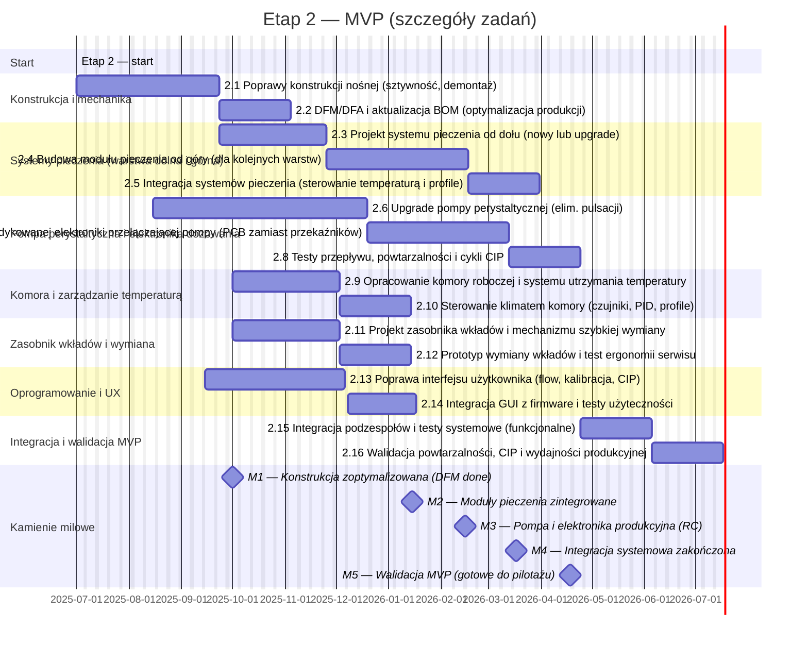

# Phase 2 — MVP (rozwój i stabilizacja)

**Cel dokumentu:** szczegółowy opis zakresu, zadań, kryteriów akceptacji i dostaw dla Etapu 2 (MVP). Dokument służy jako odniesienie dla zespołu technicznego, QA oraz interesariuszy grantowych/pilotażowych.

---
Harmonogram 

## 1. Streszczenie etapu
Etap 2 ma doprowadzić PoC do poziomu MVP zdolnego do testów użytkowych i wstępnych pilotaży. Priorytety: powtarzalność dozowania, niezawodny system pieczenia wielowarstwowy, ergonomiczny i bezpieczny system wymiany wkładów, kultura czyszczenia (CIP), stabilna elektronika sterująca wielokanałowym dozowaniem oraz użyteczny interfejs operatora.

Główne cele:
- Eliminacja pulsacji dawkowania (pompa perystaltyczna).
- Opracowanie i integracja systemów grzewczych (od dołu i górny moduł dla warstw).
- Zaprojektowanie komory roboczej z precyzyjnym utrzymaniem temperatury.
- Ulepszenie mechaniki nośnej dla stabilności i serwisu.
- Stworzenie dedykowanej elektroniki do przełączania i sterowania pompami.
- Poprawa UX i integracja firmware ↔ hardware.

---

## 2. Zakres (wysoki poziom)
W etapie 2 realizujemy:
- prace mechaniczne (wzmocnienia, DFM/DFA),
- projekt i prototypowanie systemów pieczenia (dolny i górny),
- modernizację i testy pompy perystaltycznej (wariant A → produkcyjny),
- projekt PCB sterującej układem dozowania (zastąpienie przekaźników),
- zaprojektowanie komory roboczej i systemu kontroli temperatury,
- projekt zasobnika wkładów i mechanizmu szybkiej wymiany,
- rozwój GUI (flow operatora, procedury CIP),
- integracja i walidacja systemu oraz przygotowanie RC (Release Candidate).

**Poza zakresem:** szczegółowa skala produkcyjna wkładów, integracja z systemami medycznymi, certyfikacja końcowa (przygotowanie do certyfikacji jest w zakresie — same certyfikaty w Etapie 4).

---

## 3. Zadania (szczegółowo, zgodnie z harmonogramem)

> Terminy i kolejność odzwierciedlają plan Mermaid: start 2025-07-01. Podane daty orientacyjne wynikają z kolejności zadań w harmonogramie (zadania „after ...” są uruchamiane po zakończeniu poprzednika).

**2.1 Poprawy konstrukcji nośnej (sztywność, demontaż)**  
- Okres: 2025-07-01, 60d.  
- Zakres: wzmocnienie punktów montażowych, redukcja rezonansów, uproszczenie demontażu modułów (tool-less tam, gdzie możliwe). Aktualizacja punktów mocowania, ustandaryzowanie elementów łączących.  
- Rezultat: zaktualizowane eksporty CAD + rysunki 2D, test sztywności (pomiar dewiacji w kluczowych punktach).

**2.2 DFM/DFA i aktualizacja BOM (optymalizacja produkcji)**  
- Okres: po 2.1, 30d.  
- Zakres: analiza produkcyjna, wybór standardowych elementów, aktualizacja BOM (koszt/razem).  
- Rezultat: finalny BOM.csv, notatka DFM z rekomendacjami zakupowymi.

**2.3 Projekt systemu pieczenia od dołu (nowy lub upgrade)**  
- Okres: start po 2.1, 45d.  
- Zakres: zaprojektowanie lub upgrade grzanego stołu zapewniającego równomierne podgrzewanie i stabilność temperatury; dobór grzałek, czujników i układu zasilania.  
- Rezultat: schemat grzałek, specyfikacja termiczna, pierwszy prototyp.

**2.4 Budowa modułu pieczenia od góry (dla kolejnych warstw)**  
- Okres: po 2.3, 60d.  
- Zakres: projekt i prototyp modułu górnego (punktowe/panelowe nagrzewanie) dla warstw kolejnych; bezpieczne odstępy, ochrona przed przegrzaniem.  
- Rezultat: prototyp modułu top-heating, testy wpływu na teksturę i kolor.

**2.5 Integracja systemów pieczenia (sterowanie temperaturą i profile)**  
- Okres: po 2.4, 30d.  
- Zakres: integracja bottom/top heating z firmware (profile temperaturowe, PID), testy sekwencji pieczenia wielowarstwowego.  
- Rezultat: profile temperaturowe, firmware patch, raport termiczny.

**2.6 Upgrade pompy perystaltycznej (elim. pulsacji)**  
- Okres: 2025-08-15, 90d.  
- Zakres: mechaniczne i sterownicze poprawki pompy (kompensacja pulsacji, tłumienie, materiał food-grade). Równoległe testy wariantów A/B.  
- Rezultat: CAD pompy vA, wykresy Q=f(rpm), wstępne testy pulsacji.

**2.7 Projekt i produkcja dedykowanej elektroniki przełączającej pompy (PCB zamiast przekaźników)**  
- Okres: po 2.6, 60d.  
- Zakres: projekt PCB z MOSFET/sterowaniem PWM, izolacją i zabezpieczeniami; prototypowanie PCB.  
- Rezultat: schemat, gerbery (wersja prototypowa), testy sterowania.

**2.8 Testy przepływu, powtarzalności i cykli CIP**  
- Okres: po 2.7, 30d.  
- Zakres: pełne testy przepływowe, statystyka powtarzalności dozowania (n≥30), testy CIP dla obudowy pompy i przewodów.  
- Rezultat: raport porównawczy A/B, metryki powtarzalności, procedura CIP.

**2.9 Opracowanie komory roboczej i systemu utrzymania temperatury**  
- Okres: 2025-10-01, 45d.  
- Zakres: konstrukcja komory (izolacja, przepływ powietrza, okna inspekcyjne), miejsca montażu sensorów, bezpieczeństwo.  
- Rezultat: CAD komory, lista komponentów, testy szczelności/izolacji.

**2.10 Sterowanie klimatem komory (czujniki, PID, profile)**  
- Okres: po 2.9, 30d.  
- Zakres: integracja czujników, algorytmy PID, interfejs z firmware do wyzwalania profili temperaturowych.  
- Rezultat: implementacja kontrolera klimatu, logi testów temperaturowych.

**2.11 Projekt zasobnika wkładów i mechanizmu szybkiej wymiany**  
- Okres: 2025-10-01, 45d.  
- Zakres: ergonomia, kompatybilność materiałowa, zabezpieczenia przed przeciekami, blokady mechaniczne.  
- Rezultat: CAD zasobnika, spec. materiałowa, makieta serwisowa.

**2.12 Prototyp wymiany wkładów i test ergonomii serwisu**  
- Okres: po 2.11, 30d.  
- Zakres: budowa prototypu mechanizmu wymiany, testy czasu wymiany i ergonomii.  
- Rezultat: raport ergonomii, instrukcja wymiany.

**2.13 Poprawa interfejsu użytkownika (flow, kalibracja, CIP)**  
- Okres: 2025-09-15, 60d.  
- Zakres: redesign flow operatora, dodanie procedur kalibracji i CIP, makiety i prototypy ekranów.  
- Rezultat: zestaw mockupów, zadania UI do implementacji.

**2.14 Integracja GUI z firmware i testy użyteczności**  
- Okres: po 2.13, 30d.  
- Zakres: wdrożenie GUI na urządzeniu, testy scenariuszy użytkownika (task success).  
- Rezultat: raport użyteczności, lista poprawek.

**2.15 Integracja podzespołów i testy systemowe (funkcjonalne)**  
- Okres: po 2.8 (po testach pomp), 30d.  
- Zakres: montaż wszystkich zintegrowanych modułów (mechanika, pompa, pieczenie, komora, UI) i testy funkcjonalne end-to-end.  
- Rezultat: raport integracyjny, lista krytycznych defektów.

**2.16 Walidacja powtarzalności, CIP i wydajności produkcyjnej**  
- Okres: po 2.15, 30d.  
- Zakres: pełna walidacja dojrzałości procesu: powtarzalność porcji (statystyka), czas CIP, testy wydajnościowe (przepustowość).  
- Rezultat: raport walidacyjny, rekomendacja gotowości RC.

---

## 4. Kryteria akceptacji (exit criteria) — zmapowane do zadań i kamieni milowych

> Kryteria wejścia/wyjścia są mierzalne. Spełnienie poniższych kryteriów jest wymagane do przejścia do kolejnych kamieni milowych.

**Ogólne wymagania dla etapu 2 (dotyczą wszystkich zadań):**
- Dokumentacja wyników testów dostępna w repo (publiczne podsumowania; szczegóły techniczne w repo prywatnym).
- Artefakty (CAD-eksporty, pliki raportów, mockupy) składające się na odpowiednie dostawy D2.* (patrz punkt 5).

**Kryteria szczegółowe (wybrane powiązanie z zadaniami):**

- *2.1 / 2.2 (Konstrukcja / DFM)*  
  - Akceptacja: raport DFM i zaktualizowany BOM.csv; pomiary sztywności wykazują poprawę pozycji o co najmniej X% w porównaniu do stanu przed poprawą (wartość X ustalana przez PM, zwykle 20–50% zależnie od punktu krytycznego).  
  - Warunek M1: ukończenie DFM i eksportów CAD do daty M1 (2025-09-15).

- *2.3 / 2.4 / 2.5 (Systemy pieczenia)*  
  - Akceptacja: stabilność temperatury stół/top w zadanym profilu ±2°C; test wypieku pokazuje równomierne zrumienienie i spełnienie kryteriów sensorycznych w ≥80% przypadków testowych.  
  - Warunek M2: moduły pieczenia zintegrowane i przetestowane termicznie do M2 (2025-11-01).

- *2.6 / 2.7 / 2.8 (Pompa i elektronika dozowania)*  
  - Akceptacja: CV przepływu i masy porcji dla n≥30 ≤ **5%**; wizualna redukcja pulsacji w porównaniu A vs B (raport); PCB sterująca przełącza kanały bezbłędnie i spełnia testy EMI podstawowe.  
  - Warunek M3: pompa vA + PCB prototypowe zakończone i przetestowane do M3 (2026-01-15).

- *2.9 / 2.10 (Komora i kontrola klimatu)*  
  - Akceptacja: komora utrzymuje zadane profile temperaturowe ±2°C przez zadany czas procesu; implementacja logów temperaturowych i zabezpieczeń przed przegrzaniem.

- *2.11 / 2.12 (Zasobnik wkładów)*  
  - Akceptacja: czas wymiany wkładu <= zadany limit (np. ≤ 60 s – do ustalenia przez PM), ergonomiczne testy pozytywne (task success), brak przecieków w testach ciśnieniowych.

- *2.13 / 2.14 (UI / Integracja)*  
  - Akceptacja: task success ≥ 90% w scenariuszach podstawowych (wybór wzoru, uruchomienie, kalibracja, procedura CIP), zgłoszone krytyczne błędy ≤ 5 priorytetowych.

- *2.15 / 2.16 (Integracja i walidacja)*  
  - Akceptacja RC: powtarzalność porcji ≤ 5%, CIP ≤ 10 min (procedura w praktyce), pełna lista krytycznych defektów zamknięta lub sklasyfikowana z planem naprawczym.

**Warunki przejścia do Etapu 3:** wszystkie warunki powyższe spełnione i podpis PM; M4 (MVP Release Candidate) osiągnięty (2026-02-15).

---

## 5. Kamienie milowe 

**Kamienie milowe (daty zgodne z harmonogramem):**
- **M2.1 — Konstrukcja zoptymalizowana (DFM done)** — 2025-10-15. 
- **M2.2 — Moduły pieczenia zintegrowane** — 2025-12-01. 
- **M2.3 — Pompa i elektronika produkcyjna (RC)** — 2026-03-15.
- **M2.4 — MVP Release Candidate / gotowe do pilotażu** — 2026-06-15. 

**Uwagi:** w publicznym repo umieszczamy jedynie podsumowania, zdjęcia niskiej rozdzielczości, mockupy i raporty wysokiego poziomu. Pliki produkcyjne (pełne CAD, gerbery, firmware) archiwizujemy w repo prywatnym i udostępniamy na żądanie partnerom/wnioskodawcom.

---
